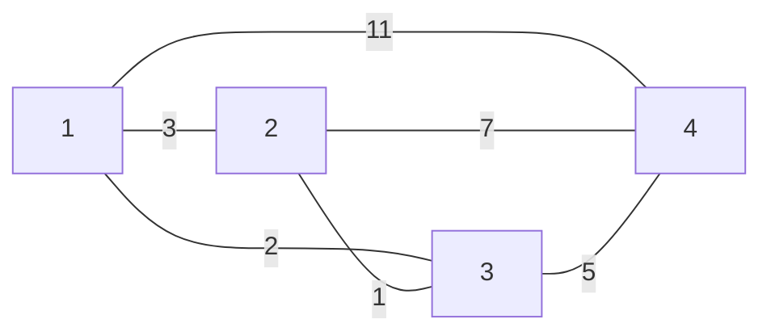
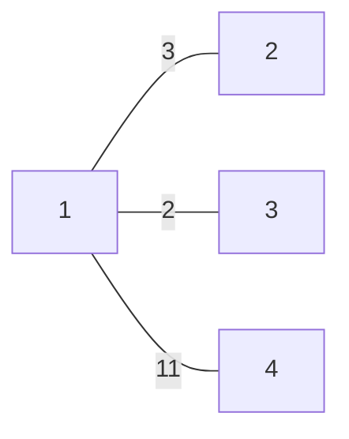
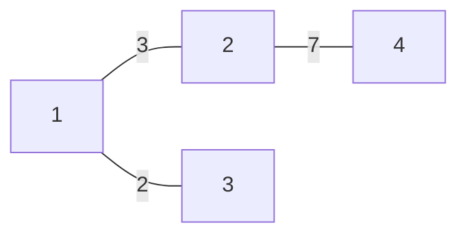
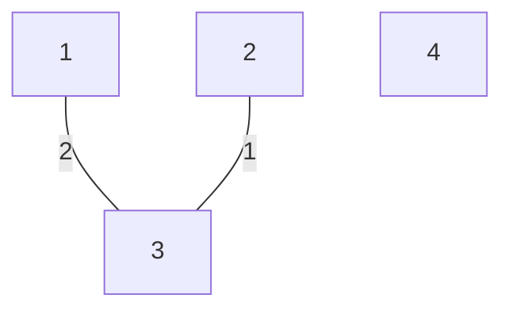

# Minimum Spanning Tree (MST)

## Concepts and Definitions

A **Minimum Spanning Tree (MST)** of a connected, undirected graph \( G \) is a tree \( T \) that spans all the vertices in \( G \) and has the minimum possible total edge weight.

- **Graph G**: \( G = (V, E) \)
- **Spanning Tree \( T \)**: \( T = (V, E') \) where \( E' \subseteq E \)

#### Example

Given a graph \( G \):

Edge weights are as illustrated in the graph.

- The **cost of a tree** \( T \) is the sum of the weights of its edges.

#### Example Trees and Their Costs

- **Tree \( T_1 \)** is formed by the edges \( \{(1, 2), (1, 3), (1, 4)\} \)
  - Cost(\( T_1 \)) = 11 (weight of 1-4) + 2 (weight of 1-3) + 3 (weight of 1-2) = 16

- **Tree \( T_2 \)** is formed by the edges \( \{(1, 2), (1, 3), (2, 4)\} \)
  - Cost(\( T_2 \)) = 3 (weight of 1-2) + 2 (weight of 1-3) + 7 (weight of 2-4) = 12

- **Tree \( T_3 \)** is formed by the edges \( \{(1, 3), (2, 3)\} \)
  - Cost(\( T_3 \)) = 2 (weight of 1-3) + 1 (weight of 2-3) = 3

---

Continuing with `Minimum Spanning Tree_Page_02.jpg`...
