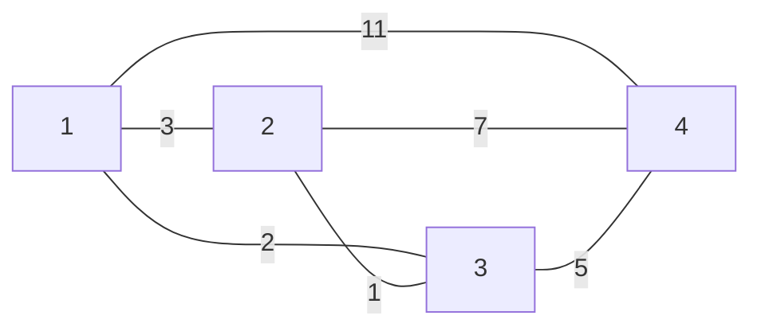
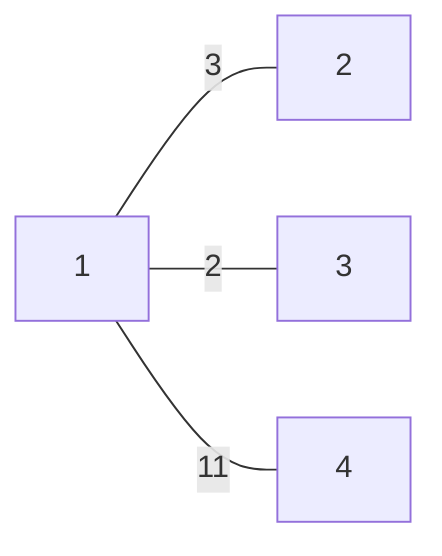
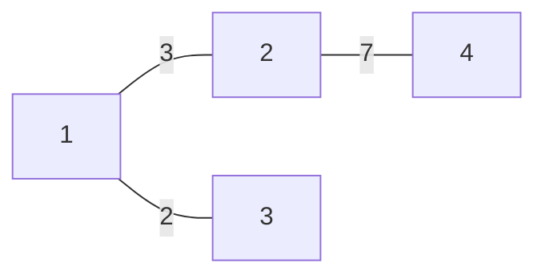
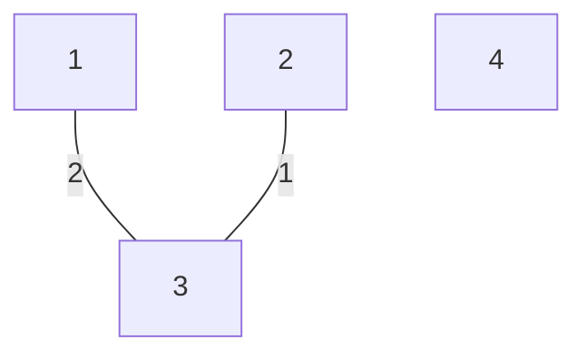
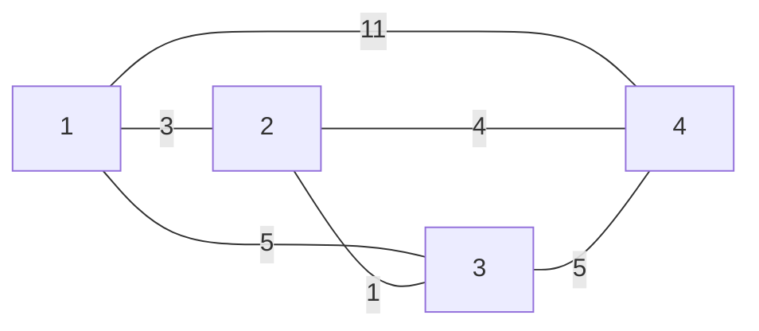
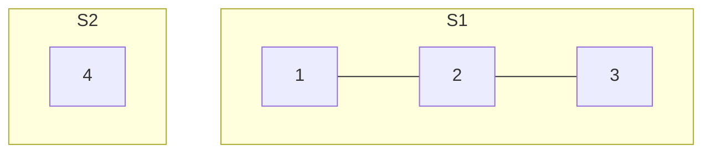
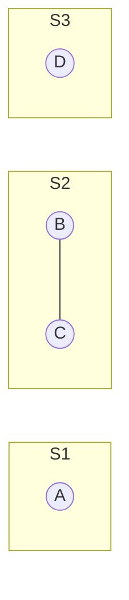
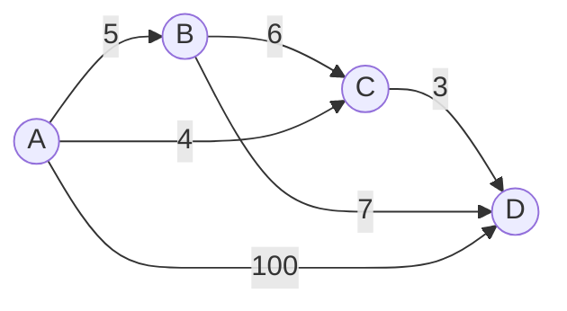
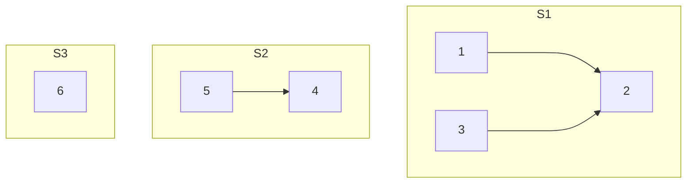
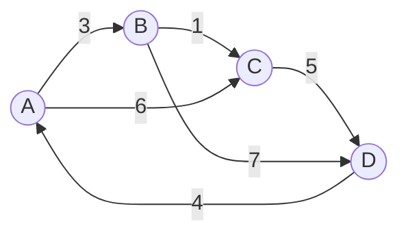

# Minimum Spanning Tree (MST)

## Concepts and Definitions

A **Minimum Spanning Tree (MST)** of a connected, undirected graph \( G \) is a tree \( T \) that spans all the vertices in \( G \) and has the minimum possible total edge weight.

- **Graph G**: \( G = (V, E) \)
- **Spanning Tree \( T \)**: \( T = (V, E') \) where \( E' \subseteq E \)

#### Example

Given a graph \( G \):



Edge weights are as illustrated in the graph.

- The **cost of a tree** \( T \) is the sum of the weights of its edges.

#### Example Trees and Their Costs

- **Tree \( T_1 \)** is formed by the edges \( \{(1, 2), (1, 3), (1, 4)\} \)
  - Cost(\( T_1 \)) = 11 (weight of 1-4) + 2 (weight of 1-3) + 3 (weight of 1-2) = 16



- **Tree \( T_2 \)** is formed by the edges \( \{(1, 2), (1, 3), (2, 4)\} \)
  - Cost(\( T_2 \)) = 3 (weight of 1-2) + 2 (weight of 1-3) + 7 (weight of 2-4) = 12



- **Tree \( T_3 \)** is formed by the edges \( \{(1, 3), (2, 3)\} \)
  - Cost(\( T_3 \)) = 2 (weight of 1-3) + 1 (weight of 2-3) = 3



---

### Minimum Spanning Tree Algorithms

Two of the most commonly used algorithms for finding the Minimum Spanning Tree (MST) in a graph are Prim's algorithm and Kruskal's algorithm.

### Prim's Algorithm

Prim's algorithm is somewhat similar to Dijkstra's algorithm for the shortest path. It grows the spanning tree from a starting position by continuously adding the smallest edge that connects a vertex in the tree to a vertex outside the tree.

#### Example of Prim's Algorithm on a Graph

Here is a graph on which we will apply Prim's algorithm:





In Prim's algorithm, we start with a vertex and select the smallest edge connecting to a vertex not yet in the MST. We continue this process until all vertices are included.

#### Pseudocode for Prim's Algorithm

```C
// A is the set of vertices included in the MST
// B is the set of vertices not yet included in the MST
// G is the graph
// u is a vertex in B with the smallest edge weight crossing the cut (A, B)
// pi is the array holding the parent of each vertex

A = {source vertex} // Start with an arbitrary vertex as the source
T = {} // T will hold the edges of the MST
while A ≠ V do
    pick u in B with the smallest edge weight crossing the cut (A, B)
    A = A ∪ {u}
    T = T ∪ {(u, pi[u])}
    for each vertex v in G.neighbors(u) do
        if v ∉ A and weight(u, v) < key[v] do
            key[v] = weight(u, v)
            pi[v] = u
```

#### Running Time Analysis

The running time of Prim's algorithm depends on the data structures used:

- With a simple array-based priority queue, the time complexity is \( O(V^2) \).
- With a binary heap as the priority queue, the time complexity improves to \( O((V+E)logV) \).
- Using a Fibonacci heap, it is further reduced to \( O(E+VlogV) \).

---

## Kruskal's Algorithm and Disjoint Sets

Kruskal's algorithm builds the minimum spanning tree (MST) by adding edges one at a time from a set of edges sorted by weight, ensuring that no cycles are formed. The disjoint sets data structure, also known as union-find, is used to keep track of which vertices are connected as the algorithm progresses.

### Disjoint Sets (Union-Find) Data Structure

Disjoint sets are a data structure that keeps track of a set of elements partitioned into non-overlapping subsets.

- **Find**: Determine which subset a particular element is in. This can be used for determining if two elements are in the same subset.
- **Union**: Join two subsets into a single subset.

#### Example of Disjoint Sets for a Graph:



### Pseudocode for Kruskal's Algorithm

```C
Kruskal's Algorithm(G)
    1. Create a forest F (a set of trees), where each vertex in the graph is a separate tree.
    2. Create a set S containing all the edges in the graph.
    3. While S is nonempty and F is not yet spanning:
        a. Remove an edge with minimum weight from S.
        b. If that edge connects two different trees, add it to the forest F, combining two trees into a single tree.

// Initialization
A = {} // A will ultimately contain the edges of the MST
for each vertex v in G.V do
    Make-Set(v) // Create disjoint sets for each vertex

// Sort all the edges of G.E by weight
Sort the edges of G.E by weight (ascending)

// Kruskal's main loop
for each edge (u, v) in G.E, ordered by increasing weight do
    if Find-Set(u) ≠ Find-Set(v) do
        A = A ∪ {(u, v)}
        Union(u, v)

return A
```

**Time Complexity Analysis:**

- The running time of Kruskal's algorithm depends on how fast we can perform the Union and Find operations.
- With a naive implementation, Union can take \( O(n) \) time and Find can also take \( O(n) \) time.
- With optimizations like union by rank and path compression, both operations can be performed in nearly constant "amortized" time, making the overall complexity \( O(E \log V) \), since the most costly operation is the initial sort of the edges.

### Visualization of Kruskal's Algorithm on a Graph



In this example, we would first add the edge from C to D, followed by the edge from A to C, and so on, always choosing the edge with the smallest weight that does not create a cycle.

In the context of MST algorithms, a 'safe' edge is an edge with the minimum weight that crosses the cut and does not form a cycle.

---

### Union-Find Data Structure for Disjoint Sets

The Union-Find data structure is crucial for efficiently managing the union and find operations on disjoint sets, especially useful in Kruskal's algorithm for finding the Minimum Spanning Tree (MST) in a graph.

#### Disjoint Sets - Logical and Physical View

Disjoint sets can be represented logically as separate groups or subsets of nodes. Physically, this is often implemented using an array where each element has a pointer to its parent, or to itself if it is the root of its set.

#### Logical View of Disjoint Sets:



#### Physical View of Disjoint Sets (using an array):

| Index | Parent |
| ----- | ------ |
| 1     | 2      |
| 2     | 2      |
| 3     | 2      |
| 4     | 4      |
| 5     | 4      |
| 6     | 6      |

## Pseudocode for the Find and Union Operations

```C
function Find(u)
    if parent[u] == u
        return u
    else
        return Find(parent[u])

function Union(u, v)
    uSet = Find(u)
    vSet = Find(v)
    parent[uSet] = vSet
```

The running time for the `Find` function is \( O(h) \), where \( h \) is the height of the tree.

## Optimization with Union by Rank and Path Compression

The Union-Find structure can be enhanced with two optimizations: union by rank and path compression. These strategies are used to improve the efficiency of finding the representative of a set (find operation) and the merging of two sets (union operation).

### Rank

The rank of a tree is a measure of its height. When uniting two sets, the root with a higher rank becomes the parent, ensuring the resulting tree's height is minimized.

```C
function Union(u, v)
    rootU = Find(u)
    rootV = Find(v)
    if rank[rootU] > rank[rootV]
        parent[rootV] = rootU
    else if rank[rootU] < rank[rootV]
        parent[rootU] = rootV
    else
        parent[rootU] = rootV
        rank[rootV] += 1

function Find(u)
    if u != parent[u]
        parent[u] = Find(parent[u])
    return parent[u]
```

In this pseudocode, rank is an array that holds the rank (height) of each tree, and parent is an array that points to the parent of each node (or to itself if it's the root). The Find function locates the representative of a set and uses path compression.

### Path Compression

Path compression is an optimization for the Find operation. During a find, we make each node on the path from the found node to the root point directly to the root, flattening the structure of the tree and making future operations faster.

#### Pseudocode for Find with Path Compression

```C
function Find(u)
    if parent[u] != u
        parent[u] = Find(parent[u])
    return parent[u]
```

The path compression optimizes the structure such that all nodes along the path are directly connected to the root, flattening the tree and reducing the time complexity of subsequent find operations.

#### Time Complexity Analysis

With these optimizations, both the Find and Union operations can be performed in O(logn) time on average, and even better, they can achieve O(α(n)) amortized time complexity, where α(n) is the inverse Ackermann function, which grows very slowly and is effectively constant for all practical values of n.

#### Claim and Proof

There is a claim related to the rank of a tree: If rank[u] = k, then the number of nodes in the tree rooted at u is at least \(2^k\).

Below is a representation of the two trees of rank `k` that are joined to form a new tree of rank `k+1`.

```plaintext
Before Union Operation:
Tree of rank k:
       w
      /|\
     / | \
  ...  ... ...
 (2^k-1 nodes)

Tree of rank k-1:
      w
      |
      x
     / \
   ... ...

After Union Operation:
New Tree of rank k+1:
       w
      / \
     /   \
    x     x
   / \   / \
 ... ... ... ...
(2 * 2^k-1 nodes)
```

The `w` represents the root of the tree with rank `k`, and `x` represents the roots of the two subtrees with rank `k-1` that are joined under `w` to form the new tree with rank `k+1`.

For the specific case of the rank being `0`, the tree is just a single node with no children, representing the base case for the induction:

```plaintext
Tree of rank 0:
 w
```

This tree contains a single node, which matches the claim since \( 2^0 = 1 \).

Each time we perform a union operation by rank, we ensure that the height of the tree increases only when two trees of equal rank are united, which helps keep the trees balanced and the operations efficient.

This can be proven by induction, and it supports the notion that using rank can help keep the trees shallow and the operations efficient.

---

### Path Compression in Union-Find

Path compression is an optimization technique used in the `Find` operation of the Union-Find data structure, which flattens the structure of the tree every time `Find` is used.

#### Pseudocode for Path Compression

```C
function Find(u)
    if parent[u] != u
        parent[u] = Find(parent[u])
    return parent[u]
```

This optimizes the tree structure, making the tree shallower and speeding up future operations.

#### Textual Visualization of a Tree with Path Compression

Before path compression, a tree might look like this, where the root node has children that are also roots of their own subtrees:

```plaintext
    root
   / | | \
 ... ... ...
```

After path compression, the tree is flattened:

```plaintext
root
|
node - node - node - node
```

Every node directly points to the root node after path compression.

#### Time Complexity Analysis

- Without path compression: \( O(\log n) \) for `Find`
- With path compression: \( O(\log n) \) for `Find`, where \( \log n \) is the iterated logarithm, indicating the number of times the logarithm function must be applied before the result is less than or equal to 1.
- Union operations have a time complexity of \( O(1) \).

---

### Cycle Detection and Connected Components in Graphs

Union-Find data structure is also useful for cycle detection in undirected graphs.

#### Pseudocode for Cycle Detection

```C
function hasCycle(graph)
    foreach edge (u, v) in graph.E
        uRoot = Find(u)
        vRoot = Find(v)
        if uRoot == vRoot
            return true  // Cycle detected
        else
            Union(uRoot, vRoot)
    return false  // No cycles found
```

#### Connected Components Identification

For finding connected components in an undirected graph:

```C
function findConnectedComponents(graph)
    foreach edge (u, v) in graph.E
        Union(Find(u), Find(v))

    if find(u) == find(v): same connected component
    if find(u) ≠ find(v): different connected components

// After the above, nodes with the same root are in the same connected component.
```

Time complexity for cycle detection and connected components identification typically relies on the efficiency of `Union` and `Find` operations, which can be \( O(m \log n) \) or better with path compression and union by rank, where \( m \) is the number of edges and \( n \) is the number of vertices.

---

### Kruskal's Algorithm Example

An example of applying Kruskal's algorithm on a graph:



### Pseudocode for Kruskal's Algorithm with Time Complexity

```C
function KruskalMST(graph)
    T = {}  // MST edges set
    edges = Sort(graph.E)  // Sort edges by weight
    foreach (u, v) in edges
        if not formsCycle(T, (u, v))
            T = T ∪ {(u, v)}
    return T
```

- Time complexity for sorting edges: \( O(E \log E) \).
- Time complexity for union-find operations: \( O(E \log n) \).

The overall time complexity of Kruskal's algorithm: \( O(E \log E) \) due to the sort.

---

### Event Scheduling Problem

The Event Scheduling Problem is an application of greedy algorithms where we have \( n \) events, each with a start time \( s_i \) and finish time \( f_i \), and we wish to find the maximum number of non-overlapping events that can be scheduled in one room.

#### Intuitive Approaches

1. Sort events by duration (\( f_i - s_i \)): not always optimal.
2. Sort by finish time (\( f_i \)): leads to an optimal solution, selecting the event that finishes first allows more room for later events.
3. Sort by start time (\( s_i \)): not always optimal.
4. Sort by the number of conflicts: not always optimal.

#### Optimal Solution

The greedy choice property leads us to choose the event with the earliest finish time first, which provides the optimal solution. After selecting an event, we remove all incompatible events and repeat the selection process.
