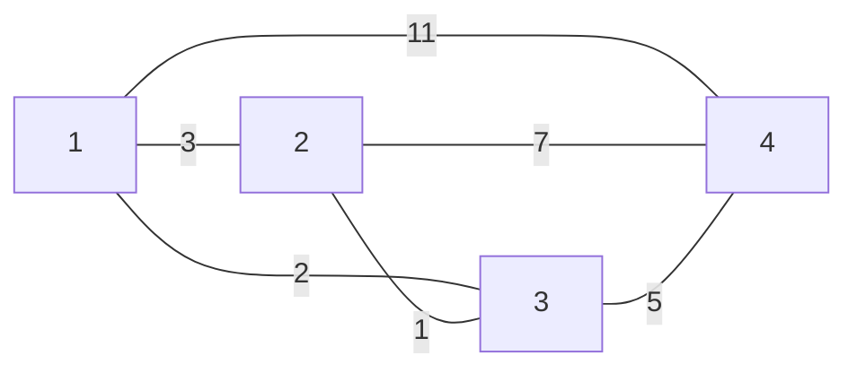
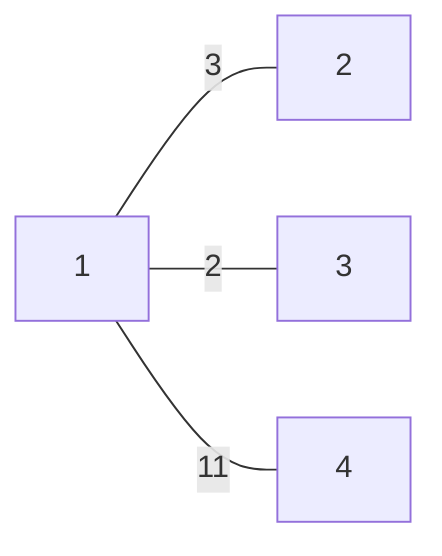
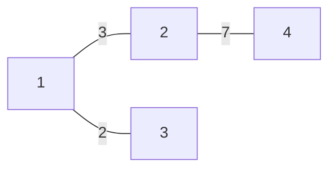
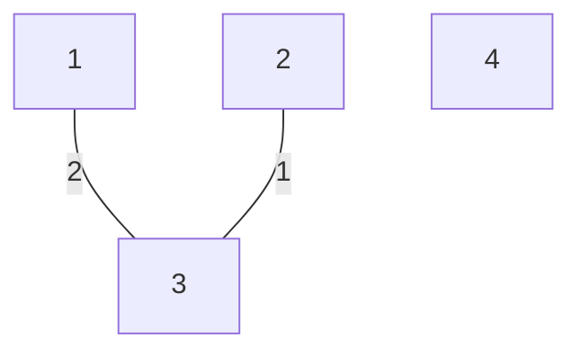
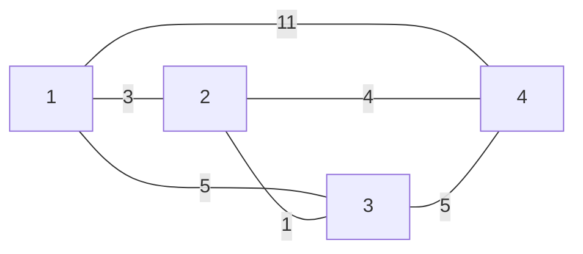
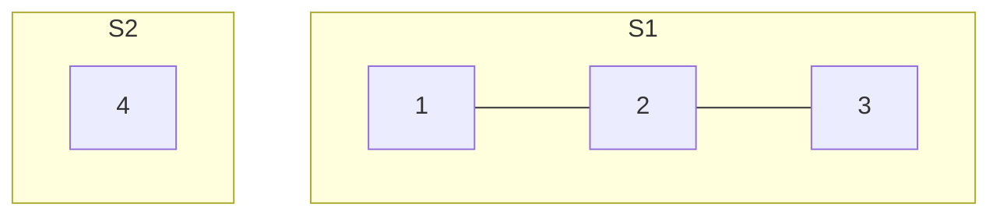
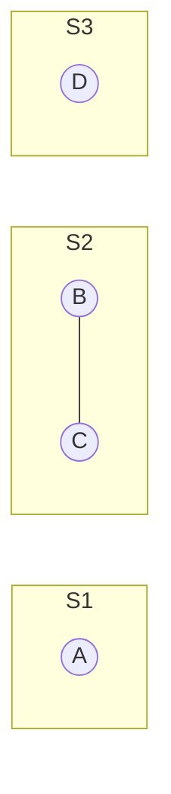
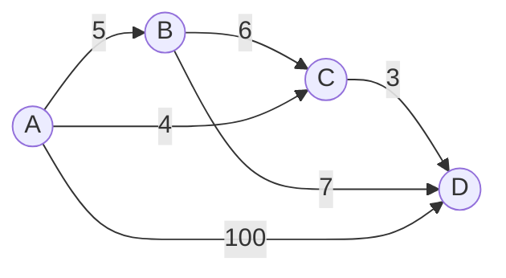

# Minimum Spanning Tree (MST)

## Concepts and Definitions

A **Minimum Spanning Tree (MST)** of a connected, undirected graph \( G \) is a tree \( T \) that spans all the vertices in \( G \) and has the minimum possible total edge weight.

- **Graph G**: \( G = (V, E) \)
- **Spanning Tree \( T \)**: \( T = (V, E') \) where \( E' \subseteq E \)

#### Example

Given a graph \( G \):



Edge weights are as illustrated in the graph.

- The **cost of a tree** \( T \) is the sum of the weights of its edges.

#### Example Trees and Their Costs

- **Tree \( T_1 \)** is formed by the edges \( \{(1, 2), (1, 3), (1, 4)\} \)
  - Cost(\( T_1 \)) = 11 (weight of 1-4) + 2 (weight of 1-3) + 3 (weight of 1-2) = 16



- **Tree \( T_2 \)** is formed by the edges \( \{(1, 2), (1, 3), (2, 4)\} \)
  - Cost(\( T_2 \)) = 3 (weight of 1-2) + 2 (weight of 1-3) + 7 (weight of 2-4) = 12



- **Tree \( T_3 \)** is formed by the edges \( \{(1, 3), (2, 3)\} \)
  - Cost(\( T_3 \)) = 2 (weight of 1-3) + 1 (weight of 2-3) = 3



---

### Minimum Spanning Tree Algorithms

Two of the most commonly used algorithms for finding the Minimum Spanning Tree (MST) in a graph are Prim's algorithm and Kruskal's algorithm.

### Prim's Algorithm

Prim's algorithm is somewhat similar to Dijkstra's algorithm for the shortest path. It grows the spanning tree from a starting position by continuously adding the smallest edge that connects a vertex in the tree to a vertex outside the tree.

#### Example of Prim's Algorithm on a Graph

Here is a graph on which we will apply Prim's algorithm:





In Prim's algorithm, we start with a vertex and select the smallest edge connecting to a vertex not yet in the MST. We continue this process until all vertices are included.

#### Pseudocode for Prim's Algorithm

```C
// A is the set of vertices included in the MST
// B is the set of vertices not yet included in the MST
// G is the graph
// u is a vertex in B with the smallest edge weight crossing the cut (A, B)
// pi is the array holding the parent of each vertex

A = {source vertex} // Start with an arbitrary vertex as the source
T = {} // T will hold the edges of the MST
while A ≠ V do
    pick u in B with the smallest edge weight crossing the cut (A, B)
    A = A ∪ {u}
    T = T ∪ {(u, pi[u])}
    for each vertex v in G.neighbors(u) do
        if v ∉ A and weight(u, v) < key[v] do
            key[v] = weight(u, v)
            pi[v] = u
```

#### Running Time Analysis

The running time of Prim's algorithm depends on the data structures used:

- With a simple array-based priority queue, the time complexity is \( O(V^2) \).
- With a binary heap as the priority queue, the time complexity improves to \( O((V+E)logV) \).
- Using a Fibonacci heap, it is further reduced to \( O(E+VlogV) \).

---

## Kruskal's Algorithm and Disjoint Sets

Kruskal's algorithm builds the minimum spanning tree (MST) by adding edges one at a time from a set of edges sorted by weight, ensuring that no cycles are formed. The disjoint sets data structure, also known as union-find, is used to keep track of which vertices are connected as the algorithm progresses.

### Disjoint Sets (Union-Find) Data Structure

Disjoint sets are a data structure that keeps track of a set of elements partitioned into non-overlapping subsets.

- **Find**: Determine which subset a particular element is in. This can be used for determining if two elements are in the same subset.
- **Union**: Join two subsets into a single subset.

#### Example of Disjoint Sets for a Graph:



### Pseudocode for Kruskal's Algorithm

```C
Kruskal's Algorithm(G)
    1. Create a forest F (a set of trees), where each vertex in the graph is a separate tree.
    2. Create a set S containing all the edges in the graph.
    3. While S is nonempty and F is not yet spanning:
        a. Remove an edge with minimum weight from S.
        b. If that edge connects two different trees, add it to the forest F, combining two trees into a single tree.

// Initialization
A = {} // A will ultimately contain the edges of the MST
for each vertex v in G.V do
    Make-Set(v) // Create disjoint sets for each vertex

// Sort all the edges of G.E by weight
Sort the edges of G.E by weight (ascending)

// Kruskal's main loop
for each edge (u, v) in G.E, ordered by increasing weight do
    if Find-Set(u) ≠ Find-Set(v) do
        A = A ∪ {(u, v)}
        Union(u, v)

return A
```

**Time Complexity Analysis:**

- The running time of Kruskal's algorithm depends on how fast we can perform the Union and Find operations.
- With a naive implementation, Union can take \( O(n) \) time and Find can also take \( O(n) \) time.
- With optimizations like union by rank and path compression, both operations can be performed in nearly constant "amortized" time, making the overall complexity \( O(E \log V) \), since the most costly operation is the initial sort of the edges.

### Visualization of Kruskal's Algorithm on a Graph



In this example, we would first add the edge from C to D, followed by the edge from A to C, and so on, always choosing the edge with the smallest weight that does not create a cycle.

In the context of MST algorithms, a 'safe' edge is an edge with the minimum weight that crosses the cut and does not form a cycle.

---
