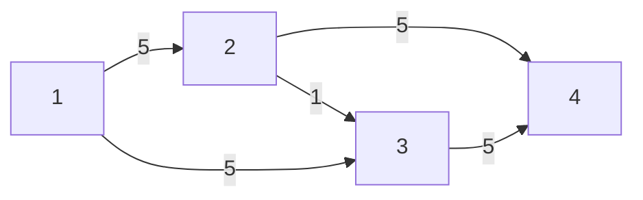
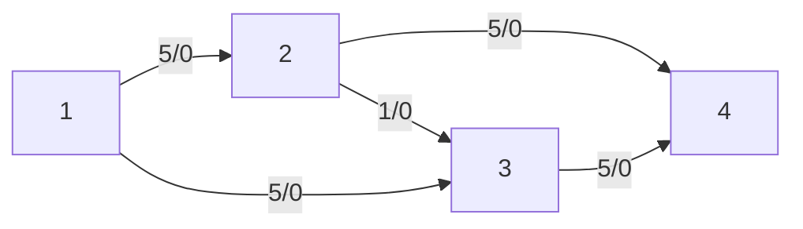
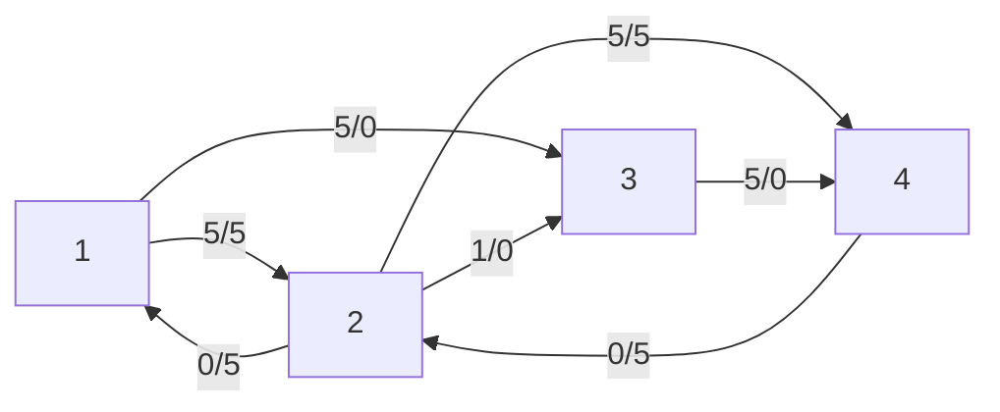
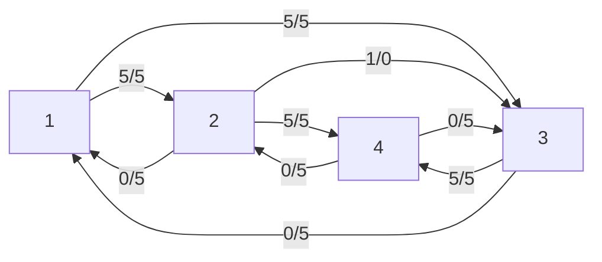
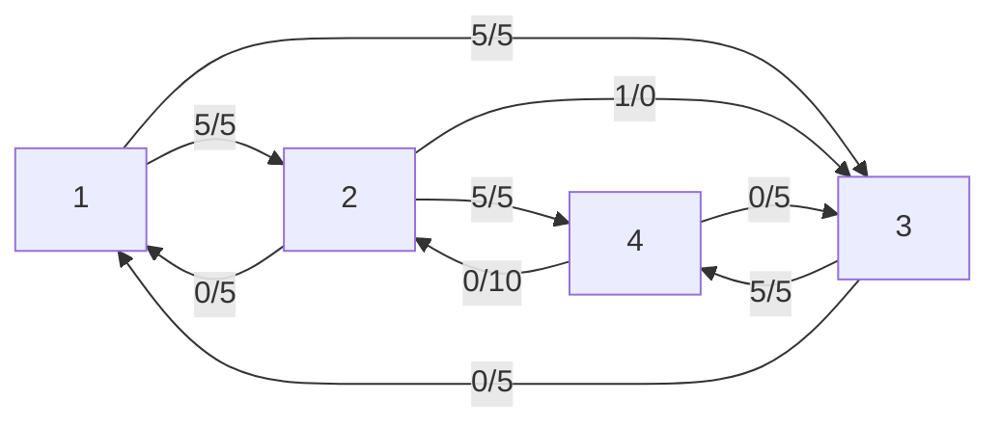
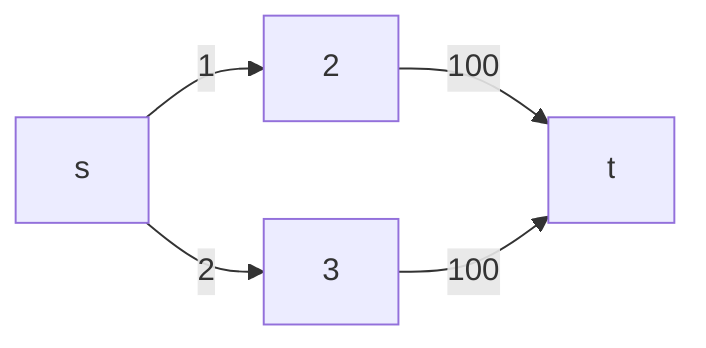
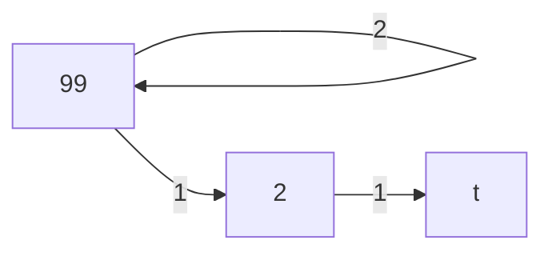
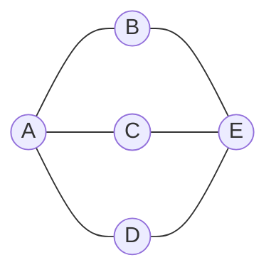
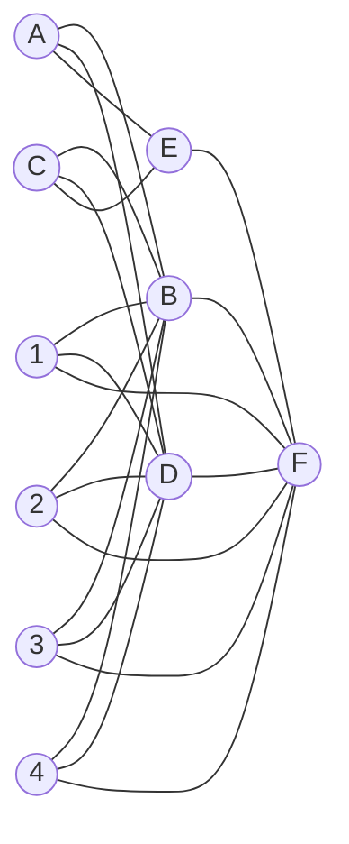

## Max Flow

- Directed graph G = (V, E)
  If (u,v) ∈ E , capacity [u,v]

- Source s is 1
- Sink t is 4

Question: What is the max flow you can push?



In this case, max flow is 10

### Ford-Fulkerson Algorithm

#### 1. augmenting path

- An augmenting path is a path from the source to the sink in the residual graph along which we can send more flow.
- It consists of edges that have a positive residual capacity, meaning they can accommodate additional flow.
- The amount of flow that can be sent along an augmenting path is equal to the minimum residual capacity of all the edges in the path.

#### 2. residual graph

- A residual graph is a graph that represents the remaining capacity of the edges in the original graph after some flow has been sent through it.
- For each edge (u, v) in the original graph with capacity c and flow f, the residual graph has two edges:
  1. (u, v) with residual capacity c - f
  2. (v, u) with residual capacity f (this is the capacity of the flow that can be "pushed back" from v to u)
- The residual graph helps in finding augmenting paths and updating the flow in the original graph.
- As flow is sent through the graph, the residual capacities of the edges change, and the residual graph is updated accordingly.

Step 1: Initialize the flow to 0.



Step 2: Find an augmenting path using BFS or DFS.
Augmenting path: 1 -> 2 -> 4
Minimum capacity along the path: min(5, 5) = 5

Step 3: Update the flow and the residual graph.



Step 4: Find another augmenting path.
Augmenting path: 1 -> 3 -> 4
Minimum capacity along the path: min(5, 5) = 5

Step 5: Update the flow and the residual graph.



Step 6: Check for more augmenting paths.
There are no more augmenting paths in the residual graph.

Therefore, the maximum flow in the given graph is 5 + 5 = 10.

The final flow and residual graph:



In this example, we found two augmenting paths, each with a flow of 5. The total maximum flow is the sum of the flows in these paths, which is 10.

Ford-Fulkerson Algorithm (f = O(m·n))

```
fm = 0
BFS
while (∃ augmenting path) {
    f = min capacity on augmenting path
    fm += f
    update G → new residual graph
}
```



BFS
s->2->t 100
s->3->t 100
DFS
s->2->3->t 1
s->3->2->t 1



Bipartite Graph



maximize the number of matches


