# Graph

## Definition of a Graph:

A graph G is defined as G = (V, E) where:

- V: set of vertices
- E: set of edges

### Directed Graph Example:

```plaintext
Directed Graph G1:
Vertices V = {1, 2, 3, 4, 5}
Edges E = {(1,2), (1,3), (2,3), (3,5), (4,2), (4,3), (5,4)}
```

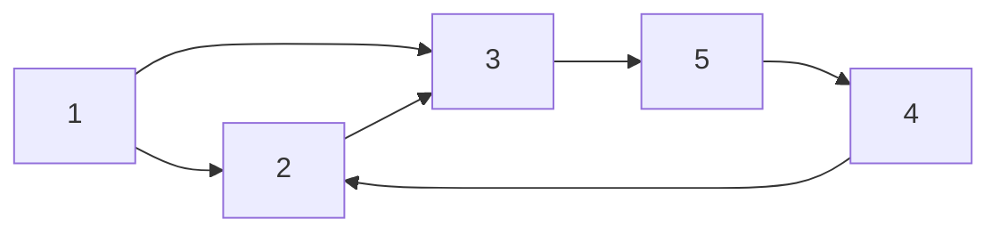

### Undirected Graph Example:

```plaintext
Undirected Graph G2:
Vertices V = {1, 2, 3, 4}
Edges E = {(1,2), (2,1), (1,3), (3,1)}
```

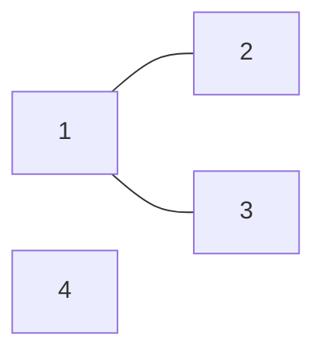

## Graph Representation:

1. **Adjacency List**

   - Example for vertex 1: [2] -> [3]
   - Example for vertex 2: [1] -> [3]
   - Example for vertex 3: [1] -> [2] -> [5]
   - Example for vertex 4: [...]

2. **Adjacency Matrix**
   - Example Matrix A for vertices 1 to 4:

```markdown
|     | 1   | 2   | 3   | 4   |
| --- | --- | --- | --- | --- |
| 1   | T   | T   | T   | F   |
| 2   | T   | F   | T   | F   |
| 3   | T   | T   | F   | F   |
| 4   | F   | T   | F   | F   |
```

Where T = true if `(u,v) ∈ E` and F = false otherwise.

---

## Space Complexity for Graph Representation:

Assuming a graph with |V| = n and |E| = m.

- **Adjacency List**: O(n + m) space
- **Adjacency Matrix**: O(n^2) space

Note:

- Self-loops with two nodes are not allowed in class examples. (n->v and v->n)

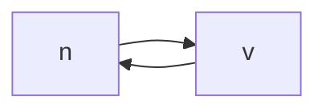

- Self-loops with single node is allowed in this class. (n->n)

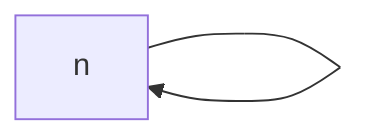

For the number of edges, we have:

- 0 ≤ m ≤ n^2
- For m = Ω(n^2), the graph is dense.
- For m = O(n), the graph is sparse.

## Operations for Graph Representations:

- **For Adjacency List**: Designed for operations that traverse neighbors.
- **For Adjacency Matrix**: Designed to determine if `(u, v) ∈ E`.

---

# Graph Search Algorithms: BFS and DFS

Graph search algorithms such as Breadth-First Search (BFS) and Depth-First Search (DFS) are fundamental techniques for traversing or searching graph data structures.

## BFS (Breadth-First Search)

BFS explores all reachable vertices in layers. It uses a queue data structure to keep track of the nodes to be explored and a boolean array `visited[]` to keep track of visited vertices.

### Defining the Graph G for BFS:

```plaintext
Directed Graph G:
Vertices V = {1, 2, 3, 4, 5}
Edges E = {(2,1), (3,1), (2,3), (3,5), (4,2), (4,5)}
```

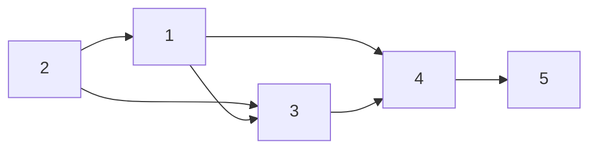

### BFS Algorithm Pseudocode:

```python
def BFS(G, S):
    queue = []
    queue.append(S)
    visited[S] = True

    while queue:
        u = queue.pop(0)  # dequeue the first element
        # Process u or perform some operations

        for v in G.neighbors(u):
            if not visited[v]:
                queue.append(v)
                visited[v] = True
```

#### For the example graph G, BFS might explore the vertices as:

```plaintext
Layers:
- Layer 0: 2
- Layer 1: 1, 3
- Layer 2: 4
- Layer 3: 5
```

### Time Complexity:

The time complexity of BFS is O(n + m), where n is the number of vertices and m is the number of edges.

## DFS (Depth-First Search)

DFS explores as far as possible along each branch before backtracking. It uses recursion and a boolean array `visited[]` to accomplish this.

### DFS Algorithm Pseudocode:

```python
def DFS(G, S, visited):
    visited[S] = True
    # Process S or perform some operations

    for v in G.neighbors(S):
        if not visited[v]:
            DFS(G, v, visited)
```

### Visiting All Vertices with DFS:

If some vertices are not connected, the time complexity is O(m).

```python
def DFS_All(G):
    visited = [False] * len(G.vertices)

    for S in range(len(G.vertices)):
        if not visited[S]:
            DFS(G, S, visited)
```

### Time Complexity:

The time complexity of DFS is O(n + m), where n is the number of vertices and m is the number of edges.

---

## DAG (Directed Acyclic Graph) and Topological Sort

DAGs do not have cycles, and a topological sort of a DAG lists all vertices in linear order, ensuring that for every directed edge u -> v, vertex u comes before v in the ordering.

### Topological Sort Example:

```plaintext
Directed Acyclic Graph:
Vertices V = {1, 2, 3, 4}
Edges E = {(2,3), (3,4), (2,4), (1,2)}
```

A topological sort might produce the sequence 1 -> 2 -> 3 -> 4.

---

## Graph Algorithms: Topological Sort and Connected Components

### Topological Sort using BFS (Kahn's Algorithm)

Assuming we have an in-degree array to keep track of the number of edges coming into each vertex, we can perform topological sorting with the following algorithm:

```python
# Step 1: Calculate in-degrees of all vertices
in_degree = [0] * n
for u in range(n):
    for v in G.neighbors(u):
        in_degree[v] += 1

# Step 2: Enqueue vertices with in-degree 0 (starting points)
queue = []
for u in range(n):
    if in_degree[u] == 0:
        queue.append(u)

# Step 3: Process vertices with in-degree 0 and update in-degrees
while queue:
    u = queue.pop(0)
    for v in G.neighbors(u):
        in_degree[v] -= 1
        if in_degree[v] == 0:
            queue.append(v)
```

The overall running time of this algorithm is `O(n + m)`.

### Depth-First Search (DFS) for Topological Sorting

Here is how we can modify the DFS algorithm to perform a topological sort:

```python
def DFS(G, s, visited, L):
    visited[s] = True
    for u in G.neighbors(s):
        if not visited[u]:
            DFS(G, u, visited, L)
    L.append(s)

def DFS_All(G):
    visited = [False] * len(G.vertices)
    L = []
    for s in range(len(G.vertices)):
        if not visited[s]:
            DFS(G, s, visited, L)
    L.reverse()
    return L
```

The modified DFS algorithm with a list `L` stores the vertices in a way that can be reversed at the end to provide a topological ordering. The time complexity of this approach is `O(n + m)`.

### Finding Connected Components in an Undirected Graph

To find connected components, we can use a breadth-first search starting from each unvisited vertex:

```python
def BFS_All(G):
    visited = [False] * len(G.vertices)
    CC = [None] * len(G.vertices)  # Connected Components
    id = 0  # Component ID

    for s in range(len(G.vertices)):
        if not visited[s]:
            id += 1
            BFS(G, s, visited, CC, id)
    return CC, id

def BFS(G, s, visited, CC, id):
    visited[s] = True
    queue = [s]
    while queue:
        u = queue.pop(0)
        CC[u] = id
        for v in G.neighbors(u):
            if not visited[v]:
                queue.append(v)
                visited[v] = True
```

The time complexity for finding connected components is `O(n + m)`.

### Representing a Grid for Land and Water Mapping

Consider a grid where 0 represents water and 1 represents land. We can traverse this grid to identify distinct land areas or 'islands'.

| 0   | 1   | 1   | 0   | 1   |
| --- | --- | --- | --- | --- |
| 0   | 1   | 0   | 0   | 0   |
| 1   | 0   | 0   | 1   | 1   |
| 0   | 0   | 0   | 1   | 1   |
| 0   | 0   | 1   | 1   | 1   |

---

## Graph Theory: Cycle Detection, DFS, and SCC

### Recap

1. **Graph**: A graph is a pair of sets (V, E) where V is the set of vertices and E is the set of edges.
2. **Adjacency List**: A graph can be represented using an adjacency list, where each vertex u has a list of its neighbors v.
3. **Adjacency Matrix**: A graph can be represented using an adjacency matrix, where each vertex u has a row and column, and the value at position (u,v) is 1 if there is an edge from u to v, and 0 otherwise.
4. **BFS**: Breadth-First Search is a graph search algorithm that explores all reachable vertices in layers.
5. **DFS**: Depth-First Search is a graph search algorithm that explores as far as possible along each branch before backtracking.
6. **DAG**: A Directed Acyclic Graph (DAG) is a directed graph with no directed cycles.
7. **Topological Sort**: A topological sort of a DAG lists all vertices in linear order, ensuring that for every directed edge u -> v, vertex u comes before v in the ordering.
8. **Connected Components**: A connected component of a graph is a maximal set of vertices such that every pair of vertices in the component is connected by a path.
9. **Strongly Connected Components**: A strongly connected component of a directed graph is a maximal set of vertices such that every pair of vertices in the component is reachable from every other vertex in the component.
10. **Cycle Detection**: A cycle in a graph is a path that starts and ends at the same vertex.
11. **DFS for Cycle Detection**: DFS can be used to detect cycles in a graph.

### Directed Acyclic Graph (DAG) and Cycle Detection

A Directed Acyclic Graph, or DAG, is a directed graph with no directed cycles. To detect cycles in a DAG, we can use the following method:

```plaintext
To identify a cycle:
1. Identify the vertices with 0 in-degree, remove them.
2. Keep doing so until you cannot remove anymore or the graph has been completely removed.
3. If the graph cannot be completely removed, there's a cycle.
```

For example, given two graphs G1 and G2:

- `G1`: Contains a cycle among the vertices.
- `G2`: No cycle, as all vertices are removed by iteratively removing those with 0 in-degree.

### Depth-First Search (DFS) for Cycle Detection

DFS is a fundamental algorithm in graph theory that can be used for various purposes, including cycle detection:

```C
DFS(G, u, color[]) {
    color[u] = Grey; // Mark the vertex as being visited
    for(v in G.neighbors(u)) {
        if (color[v] == White) {
            if (DFS(G, v, color)) return True; // Found a cycle
        } else if (color[v] == Grey) {
            return True; // Found a cycle
        }
    }
    color[u] = Black; // Mark the vertex as finished
    return False;
}
```

```C
DFS_ALL(G) {
    for(u in G.vertices) {
        color[u] = White;
    }

    for(u in G.vertices) {
        if (color[u] == White) {
            if (DFS(G, u, color)) return True; // Found a cycle
        }
    }
    return False;
}
```

### Strongly Connected Components (SCC)

In a directed graph, a Strongly Connected Component (SCC) is a subset of the graph where every vertex is reachable from every other vertex in the subset.

```plaintext
u, v ∈ SCC if and only if there exists a path from u to v and v to u.
```

### Graph Representation in Plaintext

For a directed graph `G`, a plaintext representation can be as follows:

- `Directed Graph G`: {(a->b), (b->c), ..., (g->h)}

For strongly connected components:

- `G1`: Represents a graph with one SCC.

```
G1 = {1, 2, 3, 4}
Edges: (1->2), (2->3), (3->4), (4->1), (1->4)
```

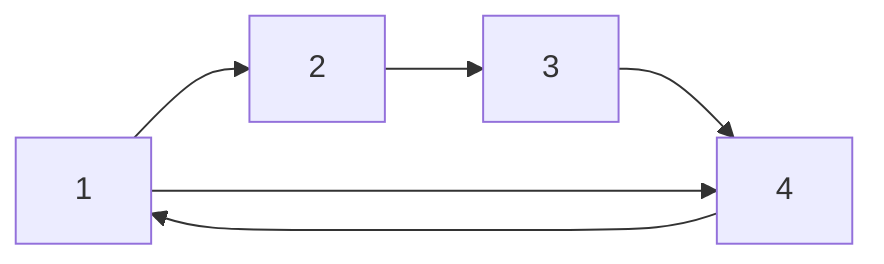

- `G2`: Represents a graph with separate SCCs.

```
G2 = {1, 2, 3, 4}
Edges: (1->2), (2->3), (3->4), (4->3), (1->4)
```

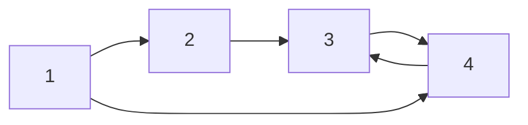

---

There are 3 Strongly Connected Components (SCCs) identified by the DFS process:

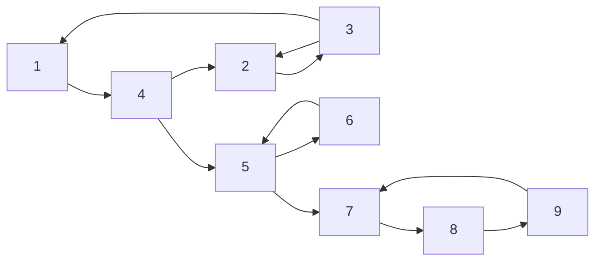

SCC 1:

- Nodes: 1, 2, 3, 4
- Directed Edges: (1->4), (2->3), (3->2), (3->1), (4->2)

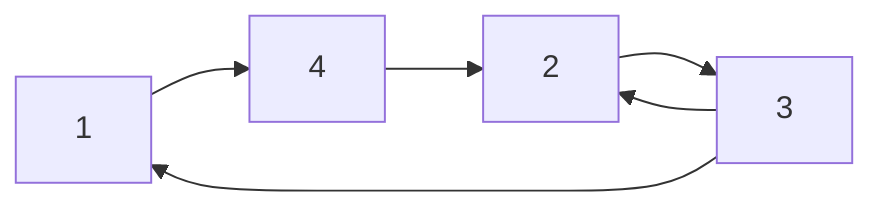

SCC 2:

- Nodes: 5, 6
- Directed Edges: (5->6), (6->5)

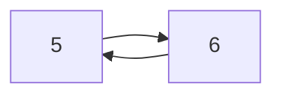

SCC 3:

- Nodes: 7, 8, 9
- Directed Edges: (7->8), (8->9), (9->7)

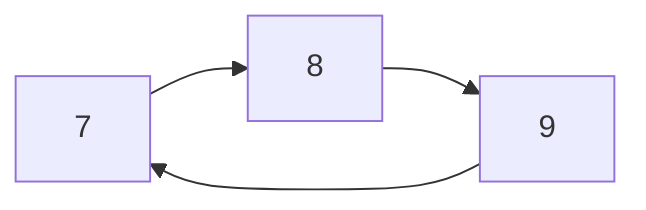

Finish Time Ordering:

- For SCC 1: Finish time is highest for node 1 and lowest for node 4.
- For SCC 2: Finish time is equal for nodes 5 and 6 since they form a cycle.
- For SCC 3: Finish time is highest for node 7 and lowest for node 9.

After reversing all directions of edges we get:

- SCC 1: (2->3), (3->2), (1->3), (2->4), (4->1)
- SCC 2: (6->5), (5->6)
- SCC 3: (8->7), (9->8), (7->9)

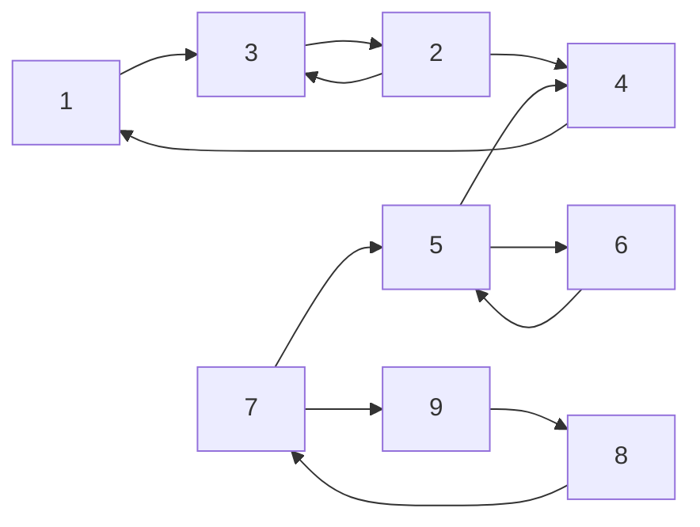

---

## Word Ladder Problem

A word ladder is a sequence of words where each word differs from the previous one by just one letter. The challenge is to find the shortest path or the minimum number of steps to transform a starting word into a target word, given that intermediate words must also be valid according to a dictionary.

### Problem Statement:

- Given:
  - A dictionary of valid words.
  - A starting word and a target word.
- Constraints:
  - Change only one letter at a time.
  - Each intermediate word must be a valid dictionary word.
- Objective:
  - Return `True` if a solution exists, `False` otherwise.
  - Find the solution with the smallest number of changes.

### Example Transformation:

Starting Word: `Cat`
Target Word: `Dog`
Transformation Sequence: `Cat` -> `Cot` -> `Dot` -> `Dog`

### Graph Representation:

Vertices represent words, and an edge connects two words if they can be transformed into each other by changing a single letter.

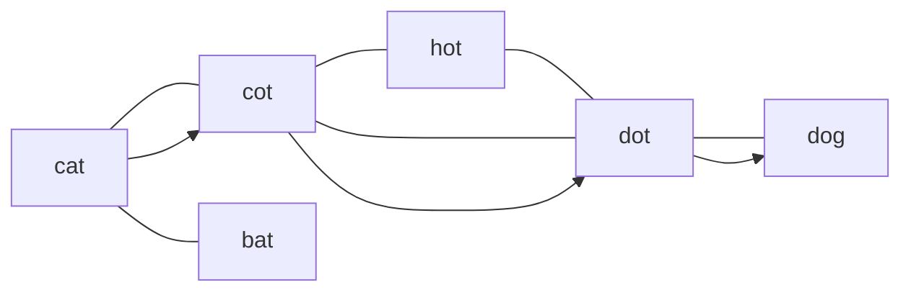

### Pseudocode

```C++
function WordLadder(start, target, dictionary):
    if start not in dictionary or target not in dictionary:
        return False

    queue = [(start, 1)]  # Each element is a tuple (word, step count)
    visited = set(start)

    while queue is not empty:
        current_word, step_count = queue.pop(0)

        if current_word == target:
            return step_count

        for i in range(len(current_word)):
            for char in 'abcdefghijklmnopqrstuvwxyz':
                next_word = current_word[:i] + char + current_word[i+1:]

                if next_word in dictionary and next_word not in visited:
                    visited.add(next_word)
                    queue.append((next_word, step_count + 1))

    return False  # No transformation sequence exists
```

---

## Puzzle-8 Problem

The 8-puzzle problem consists of a 3x3 board with tiles numbered from 1 to 8 and an empty space. The goal is to move the tiles around to achieve a specific end configuration.

### Problem Statement:

- Given:
  - A 3x3 board with numbers 1 to 8 and an empty space.
- Objectives:
  1. Return `True` if a solution exists, `False` otherwise.
  2. Find any solution that leads to the end configuration.
  3. Find a solution with the smallest number of moves.

### Graph Representation:

Each board configuration is a vertex in the graph. An edge connects two configurations if one can be reached from the other by sliding a tile into the empty space.

**Initial State:**
| 7 | 1 | 5 |
|---|---|---|
| 8 | 2 | |
| 3 | 4 | 6 |

**Goal State:**
| 1 | 2 | 3 |
|---|---|---|
| 4 | 5 | 6 |
| 7 | 8 | |

### Pseudocode

```C++
function Puzzle8Solver(initial_state, goal_state):
    queue = [(initial_state, 0)]  # Each element is a tuple (state, move count)
    visited = set(initial_state)

    while queue is not empty:
        current_state, move_count = queue.pop(0)

        if current_state == goal_state:
            return move_count

        zero_position = current_state.index(0)
        possible_moves = get_possible_moves(zero_position)

        for move in possible_moves:
            next_state = perform_move(current_state, move)
            next_state_str = state_to_string(next_state)

            if next_state_str not in visited:
                visited.add(next_state_str)
                queue.append((next_state, move_count + 1))

    return False  # No solution exists

function get_possible_moves(zero_position):
    # Depending on the position of '0', return the list of possible swaps

function perform_move(state, move):
    # Swap the '0' with the number at the move position to generate next state

function state_to_string(state):
    # Convert the state list into a string for easy hashing/comparison
```

---

## Single Source Shortest Path (SSSP)

SSSP algorithms find the shortest paths from a single source vertex to all other vertices in a graph.

### Problem Statement:

- Given:
  - A graph `G = (V, E)`.
  - Weights on edges, `weight(u,v)`, represent the cost of traveling from `u` to `v`.
  - A source vertex `S`.
- Objectives:
  - Find the shortest distance from `S` to all other vertices.
  - Optionally, also find the paths taken to reach each vertex.

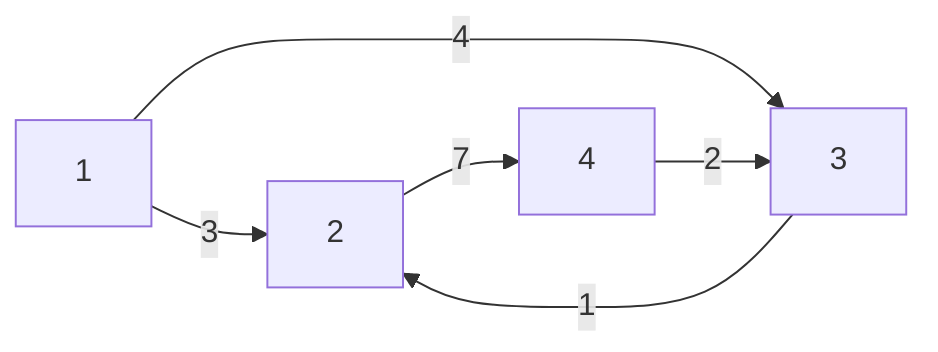

### Approaches Based on Graph Characteristics:

- If the graph is a DAG, we can solve it in `O(n+m)` time complexity.
- If the graph contains negative edge weights, Bellman-Ford algorithm may be applicable.
- For graphs with non-negative weights, Dijkstra's algorithm is the preferred choice.

### Example Problem: Shortest Path on DAG

Given a topologically sorted graph and a source vertex `S`, the algorithm is as follows:

```plaintext
Initialize distances from `S` to all vertices as infinity, except `dist[S] = 0`.
For each vertex `u` in topological order:
  For each neighbor `v` of `u`:
    Relax the edge (u, v).
```

Relaxation refers to the process of updating the shortest path if a shorter path is found.

### Pseudocode

Below is the pseudocode for the Single Source Shortest Path (SSSP) problem. The approach may vary depending on whether the graph is a Directed Acyclic Graph (DAG), or if it contains negative weight edges. For DAGs, a simple topological sort-based algorithm can be used, while for general graphs, Dijkstra's or Bellman-Ford algorithms may be applicable.

### Pseudocode for SSSP on a DAG using Topological Sort:

```C++
function TopologicalSortSSSP(G, S):
    top_order = TopologicalSort(G)  # Perform a topological sort on G
    distance = [Infinity] * |V|     # Initialize distances to infinity
    distance[S] = 0                 # Distance from S to S is 0

    for u in top_order:
        for each (u, v) in G.neighbors(u):
            if distance[u] + weight(u, v) < distance[v]:
                distance[v] = distance[u] + weight(u, v)

    return distance
```

### Pseudocode for SSSP using Dijkstra's Algorithm:

Dijkstra's algorithm can be used when all the edges have non-negative weights.

```C++
function DijkstraSSSP(G, S):
    distance = [Infinity] * |V|     # Initialize distances to infinity
    distance[S] = 0                 # Distance from S to S is 0
    priority_queue = MinHeap()      # Priority queue to select the minimum distance vertex
    priority_queue.insert(S, 0)     # Insert the source with distance 0

    while not priority_queue.isEmpty():
        u = priority_queue.extractMin()

        for each (u, v) in G.neighbors(u):
            if distance[u] + weight(u, v) < distance[v]:
                distance[v] = distance[u] + weight(u, v)
                priority_queue.decreaseKey(v, distance[v])

    return distance
```

### Pseudocode for SSSP using Bellman-Ford Algorithm:

The Bellman-Ford algorithm can handle graphs with negative weight edges and can detect negative weight cycles.

```C++
function BellmanFordSSSP(G, S):
    distance = [Infinity] * |V|     # Initialize distances to infinity
    distance[S] = 0                 # Distance from S to S is 0

    # Relax all edges |V| - 1 times
    for i from 1 to |V| - 1:
        for each edge (u, v) in G.edges:
            if distance[u] + weight(u, v) < distance[v]:
                distance[v] = distance[u] + weight(u, v)

    # Check for negative weight cycles
    for each edge (u, v) in G.edges:
        if distance[u] + weight(u, v) < distance[v]:
            return "Graph contains a negative weight cycle"

    return distance
```

In each of these pseudocode examples, `G` is the graph, `S` is the source vertex, `distance` is an array that holds the shortest distance from `S` to every other vertex, and `weight(u, v)` is the weight of the edge from vertex `u` to vertex `v`. The Bellman-Ford algorithm additionally checks for negative weight cycles, which are a condition where no solution exists for the SSSP problem.

---
