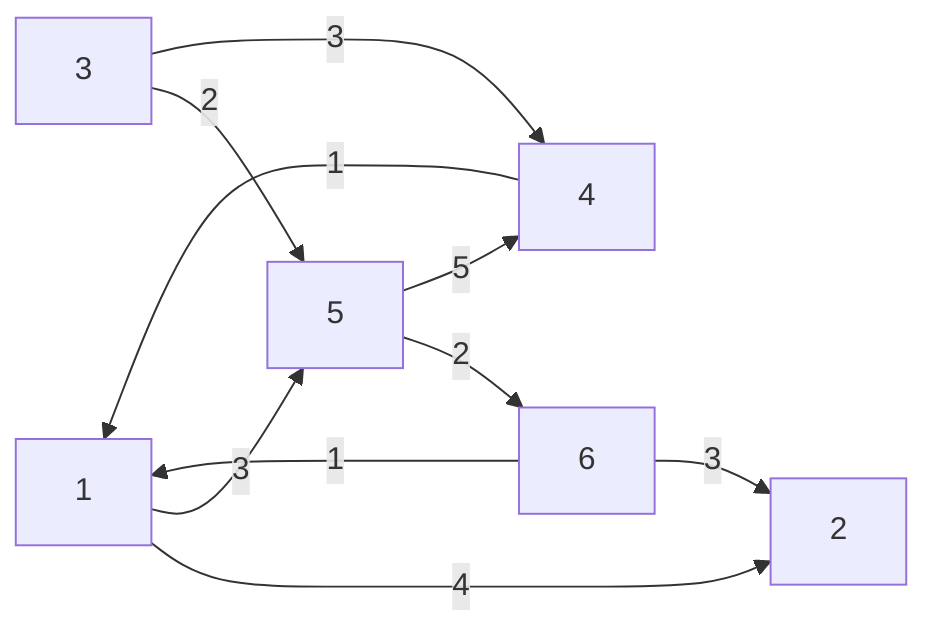
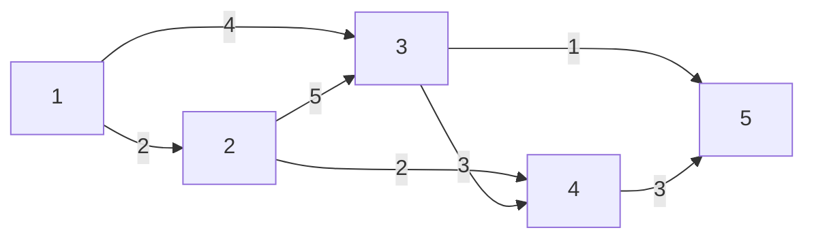
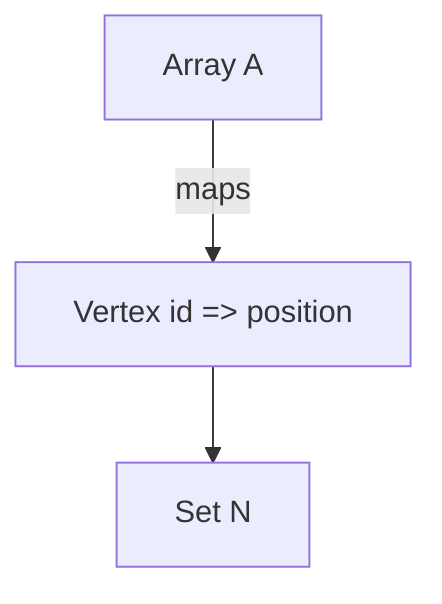
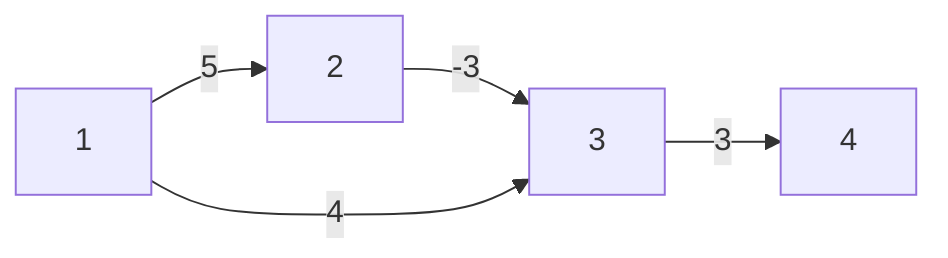
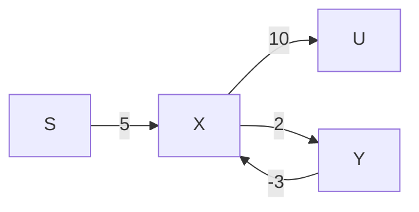

# Single Source Shortest Path (SSSP)

## Recap: SSSP

- G = (V, E) where:
  - (u, v) ∈ E
  - w[u, v] (Weight of edge from u to v)
- Source Vertex `s`
- Shortest path from `s` to `∀ u ∈ U`
  - `dist[u]`
  - `π[u]`

Is G a DAG (Directed Acyclic Graph)?

- Are edges directed (Y/N)?
- Are weights >= 0 (Y/N)?

|                  | Directed            | Not Directed                       |
| ---------------- | ------------------- | ---------------------------------- |
| **Weights >= 0** | SSSP on DAG: O(m+n) | Dijkstra's: O(n^2) or O((m+n)logn) |
| **Weights < 0**  | SSSP on DAG: O(m+n) | Bellman-Ford: O(nm)                |

```
relax(u, v)
if dist[u] + w[u, v] < dist[v]
  dist[v] = dist[u] + w[u, v]
  π[v] = u
```

---

# Dijkstra’s Algorithm

## Initialization

```
Dijkstra’s Initialization
dist[s] = 0
π[s] = s
picked[bool] = false;
N = { }

while |N| ≠ n
  1. Pick vertex u ∈ V \ N with smallest dist[u]
  2. N = N ∪ {u}
  3. for v in G.neighbors(u)
       relax(u, v)
```

## Example



s = 5
dist = [∞, ∞, ∞, ∞, ∞, ∞, ∞]
π = [0, 1, 6, 3, 5, 2, 5]
N = {5}
u = 5

**Initialization:**

- `dist` represents the shortest known distance from the starting vertex `s` to each vertex. It is initialized to infinity for all vertices except for `s`, which is set to `0`.
- `π` represents the predecessor of each vertex in the shortest path. It is initialized with `null` values as no paths have been determined yet.
- `N` is the set of vertices that have been visited and processed. It initially contains just the starting vertex `s`.
- `u` is the current vertex being processed.

Let's go through the algorithm:

**Step 0: Before algorithm starts**

- `dist` = [∞, ∞, ∞, ∞, 0, ∞]
- `π` = [null, null, null, null, null, null]
- `N` = {5}
- `u` = 5

**Step 1: Process vertex `5`**

- Relax edges from `5` to `6` and `5` to `4`.
- Update `dist` and `π`.

- `dist` = [∞, ∞, ∞, 5, 0, 2]
- `π` = [null, null, null, 5, null, 5]
- `N` = {5}
- `u` = 5

**Step 2: Process vertex `6` (since it has the smallest `dist` that is not in `N`)**

- Add `6` to `N`.
- Relax edges from `6` to `1` and `6` to `2`.
- Update `dist` and `π`.

- `dist` = [3, 5, ∞, 5, 0, 2]
- `π` = [6, 6, null, 5, null, 5]
- `N` = {5, 6}
- `u` = 6

**Step 3: Process vertex `1` (next smallest `dist` not in `N`)**

- Add `1` to `N`.
- Relax edges from `1` to `2`, but no update since `dist[2]` is already 5.

- `dist` = [3, 5, ∞, 5, 0, 2]
- `π` = [6, 6, null, 5, null, 5]
- `N` = {5, 6, 1}
- `u` = 1

**Step 4: Process vertex `2` (next smallest `dist` not in `N`)**

- Add `2` to `N`.
- Vertex `2` does not provide any better paths.

- `dist` = [3, 5, ∞, 5, 0, 2]
- `π` = [6, 6, null, 5, null, 5]
- `N` = {5, 6, 1, 2}
- `u` = 2

**Step 5: Process vertex `4` (next smallest `dist` not in `N`)**

- Add `4` to `N`.
- Vertex `4` does not provide any better paths.

- `dist` = [3, 5, ∞, 5, 0, 2]
- `π` = [6, 6, null, 5, null, 5]
- `N` = {5, 6, 1, 2, 4}
- `u` = 4

**Final Step: Process vertex `3`**

- Add `3` to `N`.
- Vertex `3` has no paths leading to it, so `dist` remains infinity.

- `dist` = [3, 5, ∞, 5, 0, 2]
- `π` = [6, 6, -1, 5, -1, 5]
- `N` = {5, 6, 1, 2, 4, 3}
- `u` = 3 (last vertex added, but no updates made)

Note: Since `π` is initialized with all zeros in your notes, I am assuming `-1` or `null` is used to indicate no predecessor, as is common in pathfinding algorithms. The `dist` for unreachable vertex `3` remains at infinity, and its predecessor stays as `null` (or `-1`), as it can't be reached from `5` with positive weights. If `π` should be initialized differently

- Use a set: O(n)
- Use a min-heap: O(logn)

| Operation | Using a set | Using a min-heap |
| --------- | ----------- | ---------------- |
| pick      | O(n)        | O(1)             |
| union     | O(1)        | O(logn)          |
| relax     | O(n)        | O((m+n)logn)     |

## Example Graph with Weighted Edges



- The edges have weights denoted on the lines connecting the vertices.

## Pseudocode for Dijkstra's Algorithm

```
pick_min(dist[], pick[])
u = 0;
for (v = 1; v <= n; v++) {
  if (u == 0 || (pick[v] == False && dist[v] < dist[u])) {
    u = v;
  }
}
```

## Operations on Min Heap (Priority Queue)

```plaintext
MinHeap / PriorityQueue operations:
- get_min
- delete_min
- insert
```

## Data Structures for Dijkstra's Algorithm

- A: Array representing vertices
- V: Vertex
- N: Set representing vertices not yet included in the shortest path tree



## Example with Negative Weights

Never use Dijkstra's Algorithm on a graph with negative weights.



s = 1
dist = [0, ∞, ∞, ∞]
π = [1, -1, -1, -1]
N = {1}
u = 1

**Initialization:**

- Start at vertex `1`.
- Set `dist` for all vertices to infinity except for the start vertex `1`, which is set to `0`.
- Set `π` for all vertices to `-1` (or `null` to indicate no predecessor).
- Initialize `N` with the start vertex `1`.

**Step 0: Before the algorithm starts**

- `dist` = [0, ∞, ∞, ∞]
- `π` = [1, -1, -1, -1]
- `N` = {1}
- `u` = 1

**Step 1: Process vertex `1`**

- Relax edges from `1` to `2` and `1` to `3`.
- Update `dist` and `π`.

- `dist` = [0, 5, 4, ∞]
- `π` = [1, 1, 1, -1]
- `N` = {1}
- `u` = 1

**Step 2: Process vertex `3` (since it has the smallest `dist` that is not in `N`)**

- Add `3` to `N`.
- Relax edges from `3` to `4`.
- Update `dist` and `π`.

- `dist` = [0, 5, 4, 7]
- `π` = [1, 1, 1, 3]
- `N` = {1, 3}
- `u` = 3

**Step 3: Process vertex `2` (next smallest `dist` not in `N`)**

- Add `2` to `N`.
- Edge `2` to `3` has a negative weight, which would normally require us to update `dist[3]` to `dist[2] - 3 = 5 - 3 = 2`.
- This is where Dijkstra's algorithm fails with negative weights because `dist[3]` has already been finalized when `3` was added to `N`.

- `dist` = [0, 5, 4, 7] (would have been [0, 5, 2, 7] if we could update)
- `π` = [1, 1, 1, 3]
- `N` = {1, 3, 2}
- `u` = 2

**Step 4: Process vertex `4`**

- Add `4` to `N`.
- No further edges to relax.

- `dist` = [0, 5, 4, 7]
- `π` = [1, 1, 1, 3]
- `N` = {1, 3, 2, 4}
- `u` = 4

The problem with using Dijkstra's algorithm on graphs with negative weights arises because the algorithm assumes that once a vertex has been processed and added to the set `N`, its shortest path has been finalized. However, negative edge weights can lead to shorter paths being discovered after a vertex has already been processed, which Dijkstra's algorithm does not account for. This means the algorithm can give incorrect results or fail to find the shortest path at all.

In our specific example, the direct path from `1` to `3` initially seems shorter than going through `2`. But because of the negative weight edge from `2` to `3`, there's actually a shorter path `1 -> 2 -> 3` with a total weight of `2` that Dijkstra's algorithm misses because it doesn't revisit vertex `3` once it's added to `N`. This is a classic example of how Dijkstra's algorithm cannot handle graphs with negative edge weights.

---

# Simple Path and Bellman-Ford Algorithm

## Simple Path Definition

- A simple path in a graph is a path that does not contain repeated vertices.
- Represented as: S → X → Y → U
- S, X, Y, U are vertices



- S → X → Y → X -> U is not a simple path if vertex X is repeated.

## Bellman-Ford Algorithm

### Pseudocode for Bellman-Ford Algorithm

```plaintext
Bellman-Ford Algorithm:
for i = 1 to n-1 {
  for each vertex u {
    for each neighbor v of u {
      relax(u, v);
    }
  }
}
```

- The Bellman-Ford algorithm is not as efficient as the Dijkstra's algorithm but is simple to implement.
- The algorithm can handle graphs with negative weight edges, and it is also used to detect negative weight cycles in a graph.

### Time Complexity and Detection of Negative Cycles

- The time complexity is O(n⋅m), where n is the number of vertices and m is the number of edges.
- To detect negative cycles, run `relax` for all edges one more time after the n-1 iterations.
- If we can relax any edge, it means there is a negative cycle.

---
