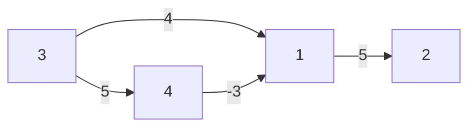
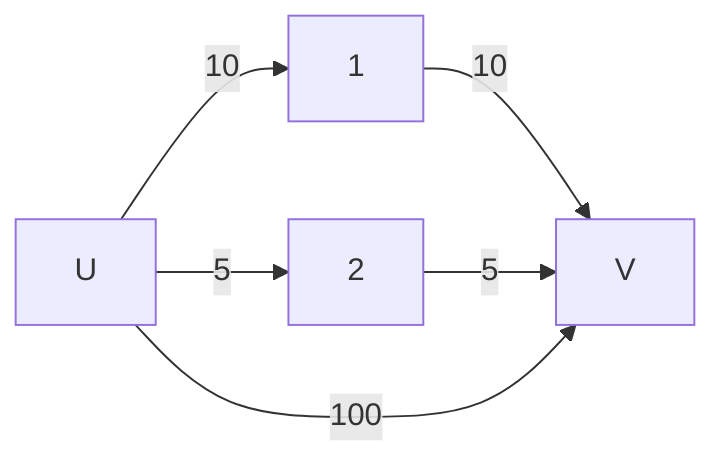

# Single Source Shortest Path (SSSP)

### Recap: SSSP

- G = (V, E) where:
  - (u, v) ∈ E
  - w[u, v] (Weight of edge from u to v)
- Source Vertex `s`
- Shortest path from `s` to `∀ u ∈ U`
  - `dist[u]`
  - `π[u]`

Is G a DAG (Directed Acyclic Graph)?

- Are edges directed (Y/N)?
- Are weights >= 0 (Y/N)?

|                  | Directed            | Not Directed                       |
| ---------------- | ------------------- | ---------------------------------- |
| **Weights >= 0** | SSSP on DAG: O(m+n) | Dijkstra's: O(n^2) or O((m+n)logn) |
| **Weights < 0**  | SSSP on DAG: O(m+n) | Bellman-Ford: O(nm)                |

```
relax(u, v)
if dist[u] + w[u, v] < dist[v]
  dist[v] = dist[u] + w[u, v]
  π[v] = u
```

---

### Dijkstra’s Algorithm

#### Initialization

```
Dijkstra’s Initialization
dist[s] = 0
π[s] = s
picked[bool] = false;
N = { }

while |N| ≠ n
  1. Pick vertex u ∈ V \ N with smallest dist[u]
  2. N = N ∪ {u}
  3. for v in G.neighbors(u)
       relax(u, v)
```

#### Example


s = 5
dist = [∞, ∞, ∞, ∞, ∞, ∞, ∞]
π = [0, 1, 6, 3, 5, 2, 5]
N = {5}
u = 5

**Initialization:**

- `dist` represents the shortest known distance from the starting vertex `s` to each vertex. It is initialized to infinity for all vertices except for `s`, which is set to `0`.
- `π` represents the predecessor of each vertex in the shortest path. It is initialized with `null` values as no paths have been determined yet.
- `N` is the set of vertices that have been visited and processed. It initially contains just the starting vertex `s`.
- `u` is the current vertex being processed.

Let's go through the algorithm:

**Step 0: Before algorithm starts**

- `dist` = [∞, ∞, ∞, ∞, 0, ∞]
- `π` = [null, null, null, null, null, null]
- `N` = {5}
- `u` = 5

**Step 1: Process vertex `5`**

- Relax edges from `5` to `6` and `5` to `4`.
- Update `dist` and `π`.

- `dist` = [∞, ∞, ∞, 5, 0, 2]
- `π` = [null, null, null, 5, null, 5]
- `N` = {5}
- `u` = 5

**Step 2: Process vertex `6` (since it has the smallest `dist` that is not in `N`)**

- Add `6` to `N`.
- Relax edges from `6` to `1` and `6` to `2`.
- Update `dist` and `π`.

- `dist` = [3, 5, ∞, 5, 0, 2]
- `π` = [6, 6, null, 5, null, 5]
- `N` = {5, 6}
- `u` = 6

**Step 3: Process vertex `1` (next smallest `dist` not in `N`)**

- Add `1` to `N`.
- Relax edges from `1` to `2`, but no update since `dist[2]` is already 5.

- `dist` = [3, 5, ∞, 5, 0, 2]
- `π` = [6, 6, null, 5, null, 5]
- `N` = {5, 6, 1}
- `u` = 1

**Step 4: Process vertex `2` (next smallest `dist` not in `N`)**

- Add `2` to `N`.
- Vertex `2` does not provide any better paths.

- `dist` = [3, 5, ∞, 5, 0, 2]
- `π` = [6, 6, null, 5, null, 5]
- `N` = {5, 6, 1, 2}
- `u` = 2

**Step 5: Process vertex `4` (next smallest `dist` not in `N`)**

- Add `4` to `N`.
- Vertex `4` does not provide any better paths.

- `dist` = [3, 5, ∞, 5, 0, 2]
- `π` = [6, 6, null, 5, null, 5]
- `N` = {5, 6, 1, 2, 4}
- `u` = 4

**Final Step: Process vertex `3`**

- Add `3` to `N`.
- Vertex `3` has no paths leading to it, so `dist` remains infinity.

- `dist` = [3, 5, ∞, 5, 0, 2]
- `π` = [6, 6, -1, 5, -1, 5]
- `N` = {5, 6, 1, 2, 4, 3}
- `u` = 3 (last vertex added, but no updates made)

Note: Since `π` is initialized with all zeros in your notes, I am assuming `-1` or `null` is used to indicate no predecessor, as is common in pathfinding algorithms. The `dist` for unreachable vertex `3` remains at infinity, and its predecessor stays as `null` (or `-1`), as it can't be reached from `5` with positive weights. If `π` should be initialized differently

- Use a set: O(n)
- Use a min-heap: O(logn)

| Operation | Using a set | Using a min-heap |
| --------- | ----------- | ---------------- |
| pick      | O(n)        | O(1)             |
| union     | O(1)        | O(logn)          |
| relax     | O(n)        | O((m+n)logn)     |

### Example Graph with Weighted Edges


- The edges have weights denoted on the lines connecting the vertices.

#### Pseudocode for Dijkstra's Algorithm

```
pick_min(dist[], pick[])
u = 0;
for (v = 1; v <= n; v++) {
  if (u == 0 || (pick[v] == False && dist[v] < dist[u])) {
    u = v;
  }
}
```

#### Operations on Min Heap (Priority Queue)

```plaintext
MinHeap / PriorityQueue operations:
- get_min
- delete_min
- insert
```

### Data Structures for Dijkstra's Algorithm

- A: Array representing vertices
- V: Vertex
- N: Set representing vertices not yet included in the shortest path tree


#### Example with Negative Weights

Never use Dijkstra's Algorithm on a graph with negative weights.


s = 1
dist = [0, ∞, ∞, ∞]
π = [1, -1, -1, -1]
N = {1}
u = 1

**Initialization:**

- Start at vertex `1`.
- Set `dist` for all vertices to infinity except for the start vertex `1`, which is set to `0`.
- Set `π` for all vertices to `-1` (or `null` to indicate no predecessor).
- Initialize `N` with the start vertex `1`.

**Step 0: Before the algorithm starts**

- `dist` = [0, ∞, ∞, ∞]
- `π` = [1, -1, -1, -1]
- `N` = {1}
- `u` = 1

**Step 1: Process vertex `1`**

- Relax edges from `1` to `2` and `1` to `3`.
- Update `dist` and `π`.

- `dist` = [0, 5, 4, ∞]
- `π` = [1, 1, 1, -1]
- `N` = {1}
- `u` = 1

**Step 2: Process vertex `3` (since it has the smallest `dist` that is not in `N`)**

- Add `3` to `N`.
- Relax edges from `3` to `4`.
- Update `dist` and `π`.

- `dist` = [0, 5, 4, 7]
- `π` = [1, 1, 1, 3]
- `N` = {1, 3}
- `u` = 3

**Step 3: Process vertex `2` (next smallest `dist` not in `N`)**

- Add `2` to `N`.
- Edge `2` to `3` has a negative weight, which would normally require us to update `dist[3]` to `dist[2] - 3 = 5 - 3 = 2`.
- This is where Dijkstra's algorithm fails with negative weights because `dist[3]` has already been finalized when `3` was added to `N`.

- `dist` = [0, 5, 4, 7] (would have been [0, 5, 2, 7] if we could update)
- `π` = [1, 1, 1, 3]
- `N` = {1, 3, 2}
- `u` = 2

**Step 4: Process vertex `4`**

- Add `4` to `N`.
- No further edges to relax.

- `dist` = [0, 5, 4, 7]
- `π` = [1, 1, 1, 3]
- `N` = {1, 3, 2, 4}
- `u` = 4

The problem with using Dijkstra's algorithm on graphs with negative weights arises because the algorithm assumes that once a vertex has been processed and added to the set `N`, its shortest path has been finalized. However, negative edge weights can lead to shorter paths being discovered after a vertex has already been processed, which Dijkstra's algorithm does not account for. This means the algorithm can give incorrect results or fail to find the shortest path at all.

In our specific example, the direct path from `1` to `3` initially seems shorter than going through `2`. But because of the negative weight edge from `2` to `3`, there's actually a shorter path `1 -> 2 -> 3` with a total weight of `2` that Dijkstra's algorithm misses because it doesn't revisit vertex `3` once it's added to `N`. This is a classic example of how Dijkstra's algorithm cannot handle graphs with negative edge weights.

---

## Simple Path and Bellman-Ford Algorithm

### Simple Path Definition

- A simple path in a graph is a path that does not contain repeated vertices.
- Represented as: S → X → Y → U
- S, X, Y, U are vertices


- S → X → Y → X -> U is not a simple path if vertex X is repeated.

## Bellman-Ford Algorithm

#### Pseudocode for Bellman-Ford Algorithm

```plaintext
Bellman-Ford Algorithm:
for i = 1 to n-1 {
  for each vertex u {
    for each neighbor v of u {
      relax(u, v);
    }
  }
}
```

- The Bellman-Ford algorithm is not as efficient as the Dijkstra's algorithm but is simple to implement.
- The algorithm can handle graphs with negative weight edges, and it is also used to detect negative weight cycles in a graph.

#### Time Complexity and Detection of Negative Cycles

- The time complexity is O(n⋅m), where n is the number of vertices and m is the number of edges.
- To detect negative cycles, run `relax` for all edges one more time after the n-1 iterations.
- If we can relax any edge, it means there is a negative cycle.

---

### Understanding the Shortest Path in a Directed Graph

Given a directed graph, we are interested in finding the shortest path from a source vertex `s` to a destination vertex `u`. The shortest path has the minimum total edge weight compared to any other path between the same vertices.

### Bellman-Ford Algorithm Example

Using the Bellman-Ford algorithm, we iterate through all the edges of the graph and relax the distances. The process is repeated `n-1` times, where `n` is the number of vertices.

**Given Graph:**



**Starting Vertex (s):** `3`

**Iteration Process:**

1. `i = 0`

   - `dist = [∞, ∞, 0, ∞, ∞]`
   - Shortest path yet to be determined for all vertices except for the source.

2. `i = 1`

   - `dist = [4, 5, 0, 9, ∞]`
   - The first iteration updates the distances of vertices directly reachable from the source.

3. `i = 2`

   - `dist = [2, 5, 0, 5, ∞]`
   - In the second iteration, the algorithm finds a shorter path to vertex `1` through vertex `2`.

4. `i = 3`
   - `dist = [2, 5, 0, 5, ∞]`
   - Subsequent iterations confirm the shortest paths or find new ones if negative cycles exist.

**Shortest Path Notation:**

A shortest path from `s` to `u` can be denoted as a sequence of vertices, starting with `s` and ending with `u`, with the property that the sum of the weights of the consecutive edges is minimized.

**Maximum Number of Edges in a Shortest Path:**

The maximum number of edges in a simple shortest path in a graph is `n-1`, where `n` is the total number of vertices.

- For a graph with `n` vertices, a shortest path can have at most `n-1` edges because a path with `n` edges would have to visit at least one vertex twice, which would not be a simple path.

**Examples:**

- `i = 1`: A path with one edge, the shortest path between two directly connected vertices.
- `i = 2`: A path with two edges, and so on.

---

## All Pairs Shortest Path

In the problem of all pairs shortest path, we want to find the shortest paths between all pairs of vertices in a graph G=(V,E). The graph can have either directed or undirected edges, which can have positive or negative weights. The goal is to find a path between every pair of vertices u and v that has the least total weight.

### Options for Finding All Pairs Shortest Paths:

Run Single Source Shortest Path (SSSP) 'n' times: One approach to finding all pairs shortest paths is to run a single source shortest path algorithm for each vertex in the graph.

| Criteria                         | DAG | Positive Weight | Time Complexity            | Algorithm                |
| -------------------------------- | --- | --------------- | -------------------------- | ------------------------ |
| Directed Acyclic Graph           | Y   | Y               | O(m + n)                   | Modified SSSP Algorithm  |
| No Negative Weight Edges         | N   | Y               | O(n^2) or O((m + n) log n) | Dijkstra’s Algorithm     |
| Has Negative Weight Edges        | N   | N               | O(n ⋅ m)                   | Bellman-Ford Algorithm   |
| Compute All Pairs Shortest Paths | N/A | N/A             | O(n^3)                     | Floyd-Warshall Algorithm |

### Modified SSSP Algorithm

The modified SSSP algorithm is a variant of the Bellman-Ford algorithm that can handle directed acyclic graphs (DAGs) with positive weight edges. The algorithm is similar to the Bellman-Ford algorithm, but it uses a queue to relax the edges in the order in which they are encountered.

The algorithm starts at the source vertex `s` and iteratively updates the distances of all vertices reachable from `s`. The algorithm uses a queue to relax the edges in the order in which they are encountered.

The algorithm terminates when the distances of all vertices have been updated `n-1` times, where `n` is the number of vertices.

1. Initialize the distances of all vertices to infinity except for the source vertex `s`, which is set to 0.
2. Initialize a queue with the source vertex `s`.
3. For each vertex `u` in the queue, relax all the edges from `u` to its neighbors.
4. If any edge is relaxed, add the neighbor to the queue.
5. Repeat steps 3-4 until the queue is empty or the distances of all vertices have been updated `n-1` times.

#### Modified SSSP Algorithm for DAG

```C++
// Topologically sort the DAG to determine the order of processing vertices
topological_order = topological_sort(DAG)

// Initialize distances and predecessors
for each vertex v in DAG:
    dist[v] = infinity
    predecessor[v] = null
dist[s] = 0 // Set the source vertex distance to zero

// Relax the edges according to the topological order
for each vertex u in topological_order:
    for each neighbor v of u:
        // Relaxation step
        if dist[u] + weight(u, v) < dist[v]:
            dist[v] = dist[u] + weight(u, v)
            predecessor[v] = u
```

### Floyd-Warshall Algorithm Example:

The Floyd-Warshall algorithm uses a matrix to store the shortest path distances between each pair of vertices. The algorithm iteratively updates the matrix to find the shortest paths using a dynamic programming approach.

Given Graph for Floyd-Warshall Example:



f_0(u, v) = 100
f_1(u, v) = min{f_0(u, v), f_0(u, 1) + f_1(1, v)}
f_2(u, v) = min{f_1(u, v), f_1(u, 2) + f_1(2, v)}

#### Floyd-Warshall Initialization:

The Floyd-Warshall algorithm uses a matrix to store the shortest path distances between each pair of vertices. The algorithm iteratively updates the matrix to find the shortest paths using a dynamic programming approach.

The algorithm initializes the matrix with the edge weights of the graph. If there is no edge between two vertices, the weight is set to infinity.

The algorithm then iteratively updates the matrix to find the shortest paths between all pairs of vertices. The algorithm uses the following recurrence relation:

f_k(u,v) = min(f_k-1(u,v), f_k-1(u,k) + f_k-1(k,v))

where f_k(u,v) is the shortest path distance from vertex u to vertex v using at most k edges.

f_0(u,v)=∞ for all u,v except when u=v or there is an edge (u,v).

f_0(u,v)=w(u,v) for all edges (u,v) in the graph.

#### Pseudocode for Floyd-Warshall Algorithm:

```C++
// A is the adjacency matrix where A[u][v] is the weight of the edge (u, v)
// n is the number of vertices

// Initialize the solution matrix same as the input graph matrix
for u = 1 to n {
    for v = 1 to n {
        if there is an edge from u to v then
            dist[u][v] = weight of edge (u, v)
        else if u = v then
            dist[u][v] = 0
        else
            dist[u][v] = infinity
    }
}

// Adding vertices individually to the set of intermediate vertices
for k = 1 to n {
    // Pick all vertices as source one by one
    for u = 1 to n {
        // Pick all vertices as destination for the above-picked source
        for v = 1 to n {
            // If vertex k is on the shortest path from u to v, then update the value of dist[u][v]
            if dist[u][k] + dist[k][v] < dist[u][v] then
                dist[u][v] = dist[u][k] + dist[k][v]
        }
    }
}

return dist
```

#### Time Complexity of Floyd-Warshall Algorithm:

The Floyd-Warshall algorithm has a time complexity of O(n^3), where n is the number of vertices. The algorithm is used to find the shortest path between all pairs of vertices in a graph.

#### Considerations When Using Floyd-Warshall Algorithm:

- This algorithm is very efficient for dense graphs where m is close to n^2.
- It is suitable for graphs with negative weights, as long as there are no negative cycles.
- If a negative cycle is present, the algorithm will detect it by finding a distance that becomes negative in the diagonal of the distance matrix.
