| Pattern Type | Pattern Name            | Definition                                                                                                                                               | Problem                                                                                                                        | Solution                                                                                                                                                         | Example                                                                                                                                         |
| ------------ | ----------------------- | -------------------------------------------------------------------------------------------------------------------------------------------------------- | ------------------------------------------------------------------------------------------------------------------------------ | ---------------------------------------------------------------------------------------------------------------------------------------------------------------- | ----------------------------------------------------------------------------------------------------------------------------------------------- |
| Creational   | Abstract Factory        | Provides an interface for creating families of related or dependent objects without specifying their concrete classes.                                   | Need for consistent sets of products                                                                                           | Define an interface or abstract class for creating a family of products.                                                                                         | A GUI toolkit might use an abstract factory pattern to ensure that all widgets in a UI match the look-and-feel.                                 |
| Creational   | Builder                 | Separates the construction of a complex object from its representation so that the same construction process can create different representations.       | Complex object creation should be independent of the parts that make up the object and how they're assembled.                  | Builder pattern separates the construction of a complex object from its representation.                                                                          | Java's `StringBuilder` class follows the Builder pattern.                                                                                       |
| Creational   | Factory Method          | Defines an interface for creating an object, but lets subclasses decide which class to instantiate.                                                      | Uncertainty over the class of objects to be created.                                                                           | A method is defined which creates the object, the subclasses can override this method to change the class of the created object.                                 | `java.util.Calendar#getInstance()`                                                                                                              |
| Creational   | Prototype               | Specify the kinds of objects to create using a prototypical instance, and create new objects by copying this prototype.                                  | A system should be independent of how its products are created, composed and represented.                                      | Implementing the `Cloneable` interface to indicate that an object can be cloned.                                                                                 | `java.lang.Object#clone()`                                                                                                                      |
| Creational   | Singleton               | Ensure a class has only one instance, and provide a global point of access to it.                                                                        | The application needs one, and only one, instance of an object.                                                                | A class is designed so only one instance can be created.                                                                                                         | `java.lang.Runtime#getRuntime()`                                                                                                                |
| Structural   | Adapter                 | Convert the interface of a class into another interface clients expect.                                                                                  | Incompatibility of interfaces.                                                                                                 | An adapter wraps the incompatible object in an interface which can be used by others.                                                                            | `java.io.InputStreamReader(InputStream)` (returns a `Reader`)                                                                                   |
| Structural   | Bridge                  | Decouple an abstraction from its implementation so that the two can vary independently.                                                                  | An abstraction and its implementation should be extendable independently.                                                      | Separation of the interface from its implementation.                                                                                                             | AWT (Abstract Window Toolkit), where Peer interface acts as a bridge.                                                                           |
| Structural   | Composite               | Compose objects into tree structures to represent part-whole hierarchies.                                                                                | Need to treat a group of objects in the same way as a single instance of an object.                                            | Defines classes for composite structures and individual elements, with a common interface.                                                                       | `java.awt.Component` and `java.awt.Container`                                                                                                   |
| Structural   | Facade                  | Provide a unified interface to a set of interfaces in a subsystem.                                                                                       | Difficulty in using a subsystem with multiple interfaces.                                                                      | A facade class is introduced to hide the complexity.                                                                                                             | `javax.faces.context.FacesContext` uses a facade pattern in Java for the JSF framework.                                                         |
| Structural   | Flyweight               | Use sharing to support large numbers of fine-grained objects efficiently.                                                                                | Many similar objects are used that use up a lot of memory.                                                                     | The flyweight pattern can be used to reduce the memory usage.                                                                                                    | Java’s `Integer` valueOf() method.                                                                                                              |
| Structural   | Proxy                   | Provide a surrogate or placeholder for another object to control access to it.                                                                           | Protect the real component from complexity of its creation and maintainance.                                                   | A class representing a service that needs to be controlled is introduced.                                                                                        | `java.rmi.*`                                                                                                                                    |
| Behavioral   | Chain-of-responsibility | Avoid coupling the sender of a request to its receiver by giving more than one object a chance to handle the request.                                    | Multiple objects can handle a request and the handler doesn't have to be a specific object.                                    | The request is passed along a chain of potential handlers until one handles it.                                                                                  | Java's Exception handling mechanism is a good example.                                                                                          |
| Behavioral   | Command                 | Encapsulate a request as an object, thereby letting you parameterize clients with queues, requests, and operations.                                      | Need to issue requests to objects without knowing anything about the operation being requested or the receiver of the request. | Encapsulate all details of an operation in a separate command object.                                                                                            | `java.lang.Runnable`                                                                                                                            |
| Behavioral   | Interpreter             | Given a language, define a representation for its grammar along with an interpreter that uses the representation to interpret sentences in the language. | A problem domain involves processing language sentences, therefore a grammar for the language is required.                     | Define a grammar for the language and map each grammar rule with a class.                                                                                        | `java.util.regex.Pattern`                                                                                                                       |
| Behavioral   | Iterator                | Provide a way to access the elements of an aggregate object sequentially without exposing its underlying representation.                                 | Need a way to traverse an aggregate object and access its data elements.                                                       | The iterator pattern lets you traverse elements sequentially without needing to understand the underlying representation.                                        | `java.util.Iterator`                                                                                                                            |
| Behavioral   | Mediator                | Define an object that encapsulates how a set of objects interact.                                                                                        | Interactions between multiple objects leads to high coupling.                                                                  | Introduce a mediator object that controls how objects interact.                                                                                                  | `java.util.Timer` (the mediator between TimerTask and the JVM for scheduling)                                                                   |
| Behavioral   | Memento                 | Capture and externalize an object's internal state so that the object can be restored to this state later.                                               | Need to save and restore the internal state of an object without violating encapsulation.                                      | Memento pattern saves the state of the object in another object.                                                                                                 | `java.util.Date` (the getter methods act as caretaker, while java itself acts as originator)                                                    |
| Behavioral   | Observer                | Define a one-to-many dependency between objects so that when one object changes state, all its dependents are notified and updated automatically.        | Need to notify dependent objects about the state change.                                                                       | Observer pattern allows notifying other objects of changes in state.                                                                                             | `java.util.Observer` `java.util.Observable`                                                                                                     |
| Behavioral   | State                   | Allow an object to alter its behavior when its internal state changes. The object will appear to change its class.                                       | The behavior of an object depends on its state and it must change its behavior at run-time depending on that state.            | State pattern allows an object to change its behavior when its internal state changes.                                                                           | `javax.faces.lifecycle.LifeCycle#execute()` (controlled by `FacesServlet`, the behavior is dependent on current phase (state) of JSF lifecycle) |
| Behavioral   | Strategy                | Define a family of algorithms, encapsulate each one, and make them interchangeable.                                                                      | An algorithm varies independently from clients that use it.                                                                    | Define a common interface for all supported algorithms.                                                                                                          | `java.util.Comparator`                                                                                                                          |
| Behavioral   | Template Method         | Define the skeleton of an algorithm in an operation, deferring some steps to subclasses.                                                                 | Algorithms can have common parts but also require specialization.                                                              | Define the parts of the algorithm that are invariant in the superclass, and encapsulate the variable parts in methods that are supplied by subclasses.           | `java.io.InputStream`                                                                                                                           |
| Behavioral   | Visitor                 | Represent an operation to be performed on the elements of an object structure.                                                                           | Different operations need to be performed on the objects in a complex structure at runtime.                                    | The visitor pattern lets you apply one or more operation to a set of objects at runtime without having the operations tightly coupled with the object structure. | `javax.lang.model.element.Element` and `javax.lang.model.element.ElementVisitor`                                                                |

# Visualization of Design Patterns

Certainly! I'll group and number the diagrams under their respective categories.

### Creational Patterns

1. **Abstract Factory**

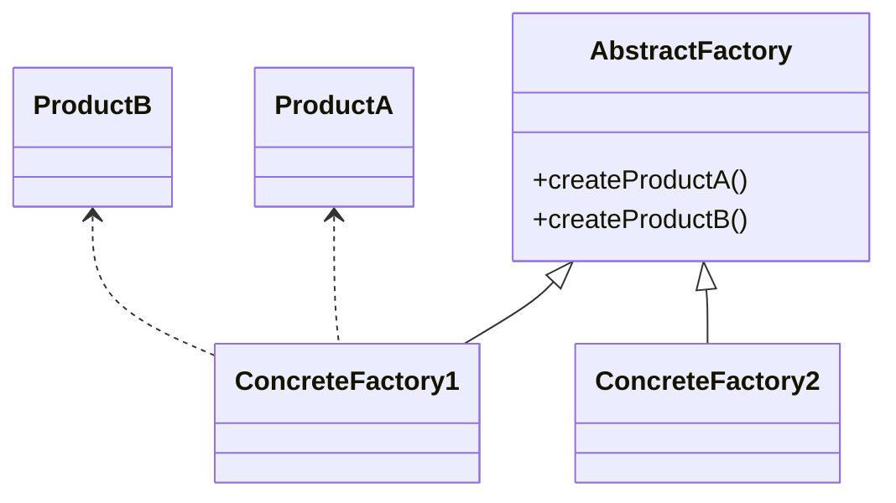

2. **Builder**

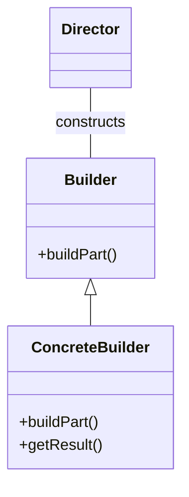

3. **Factory Method**

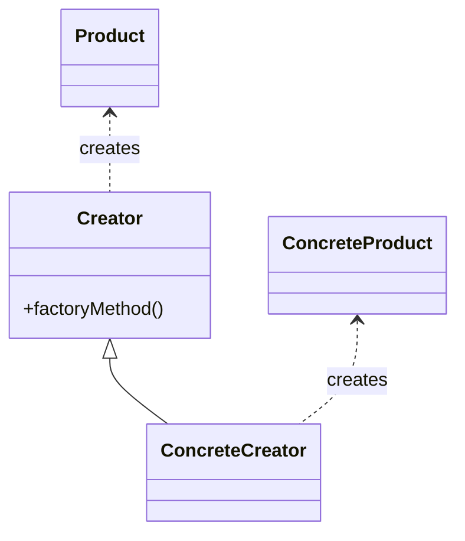

4. **Prototype**

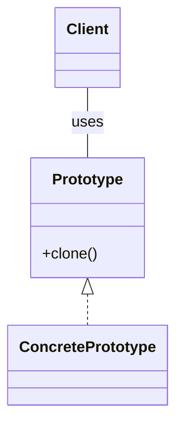

5. **Singleton**

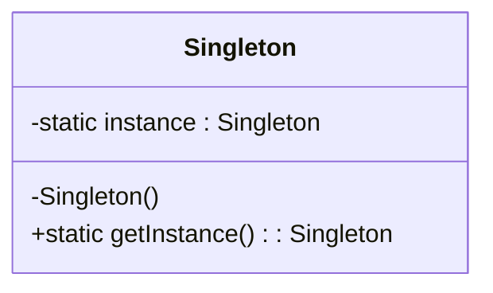

### Structural Patterns

6. **Adapter**

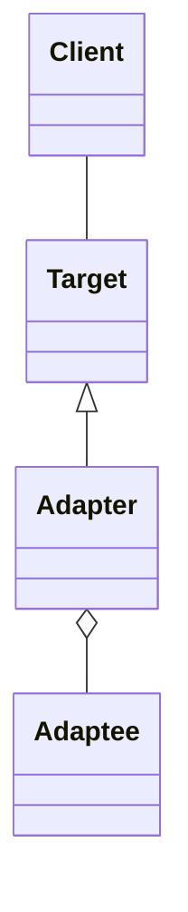

7. **Bridge**

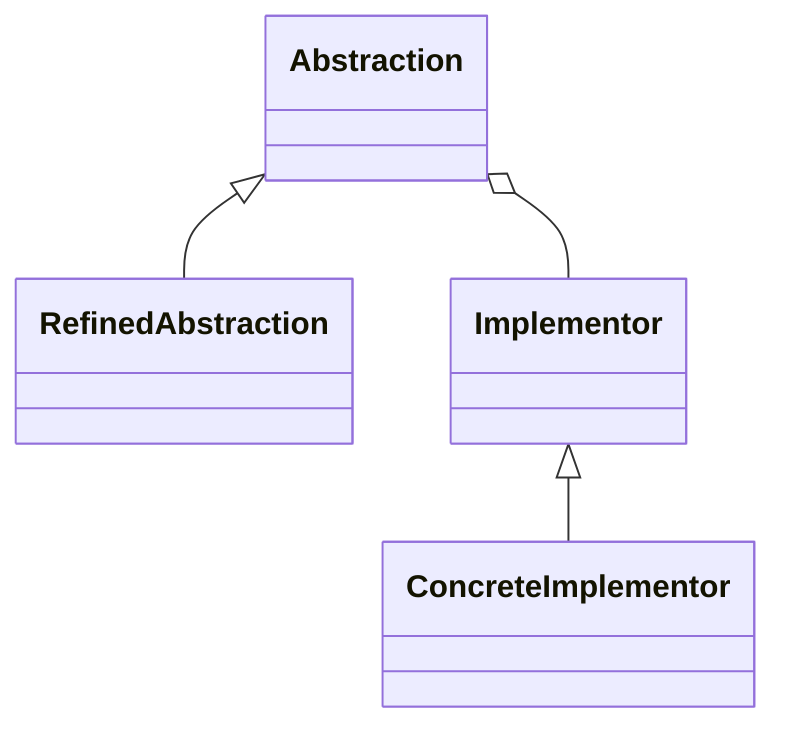

8. **Composite**

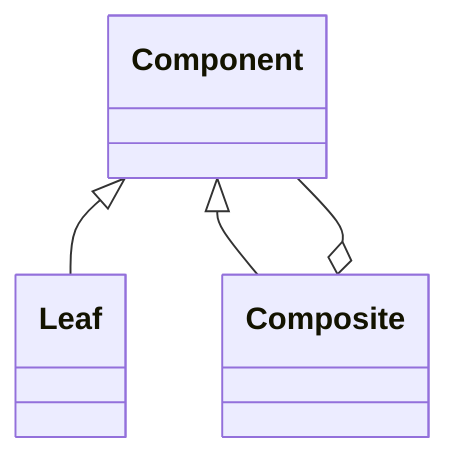

9. **Decorator**

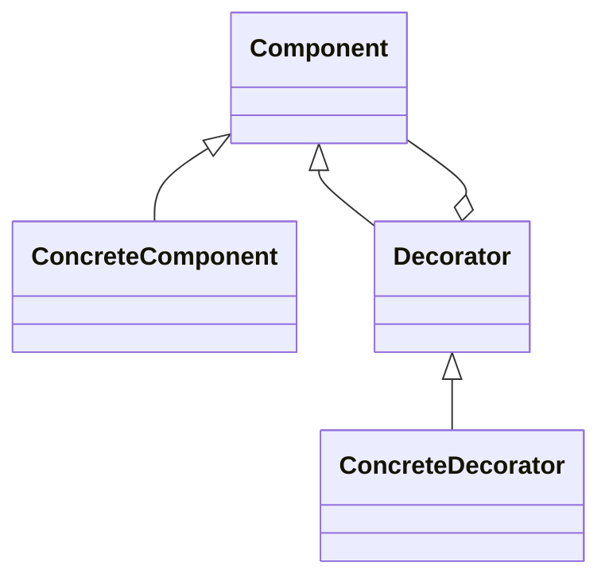

10. **Façade**

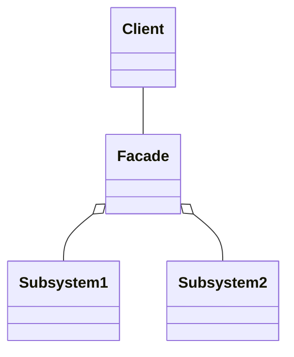

11. **Flyweight**

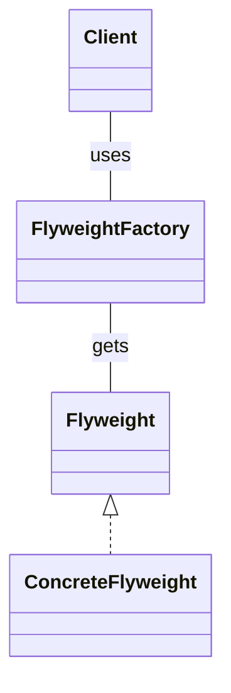

12. **Proxy**

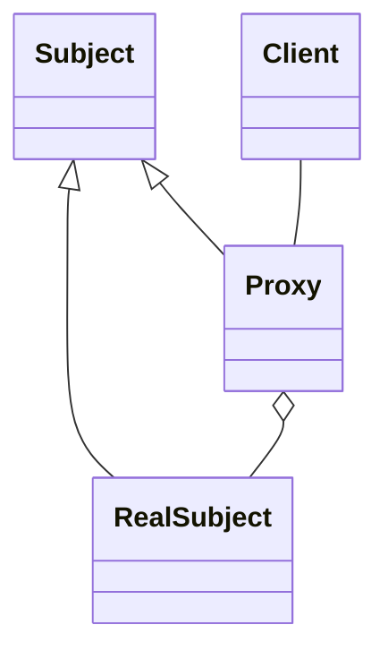

### Behavior Patterns

13. **Chain-of-responsibility**

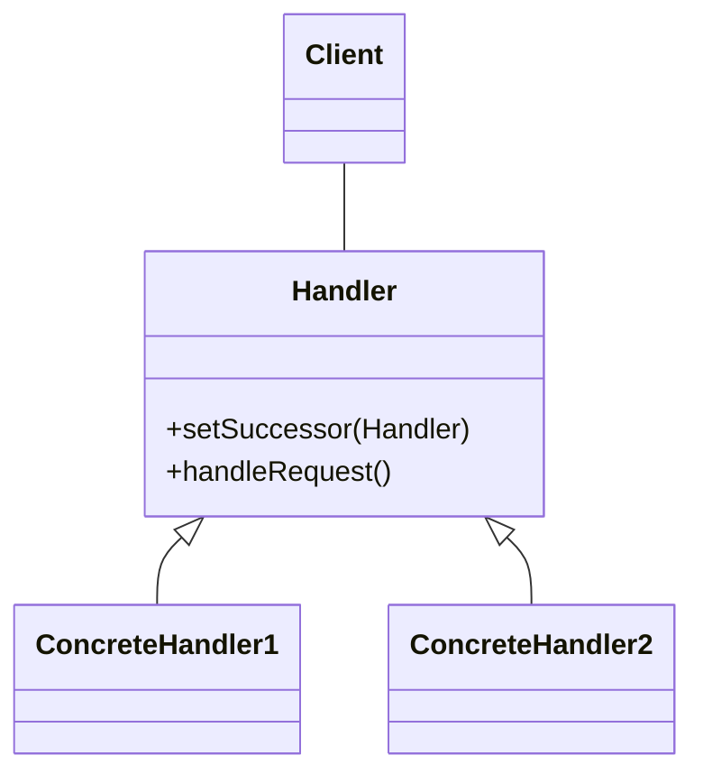

14. **Command**

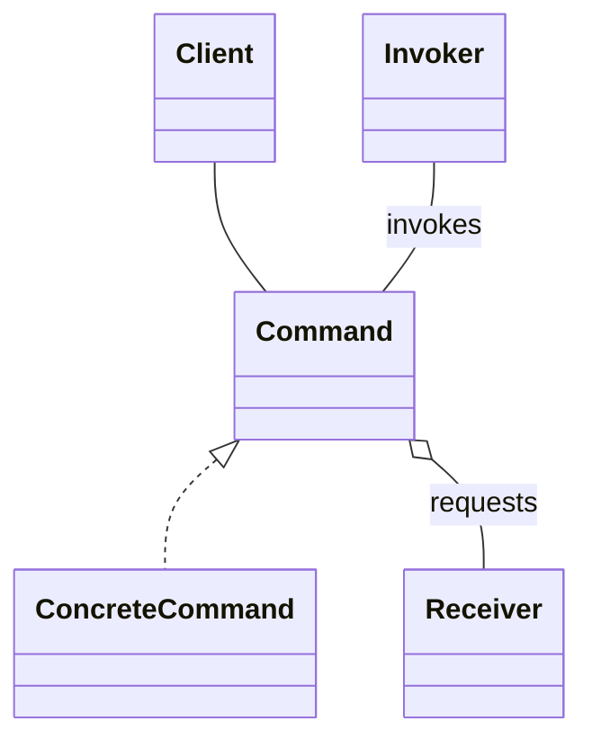

15. **Interpreter**

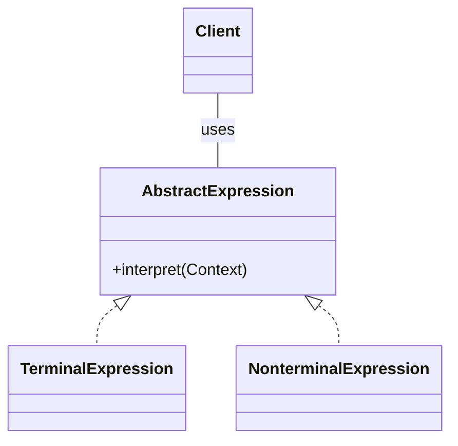

16. **Iterator**

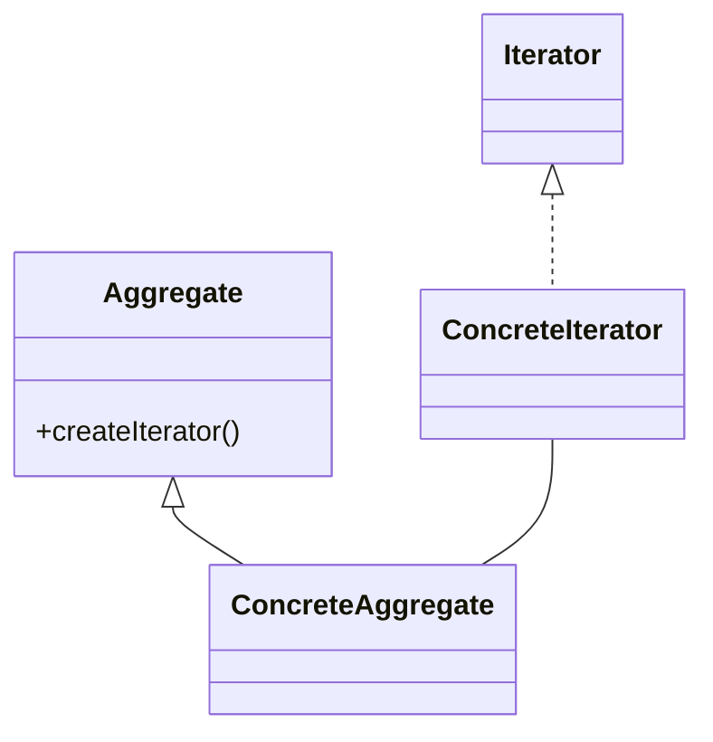

17. **Mediator**

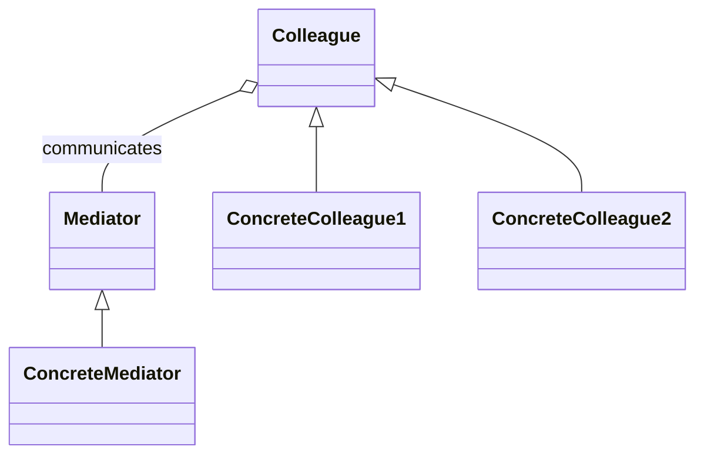

18. **Memento**

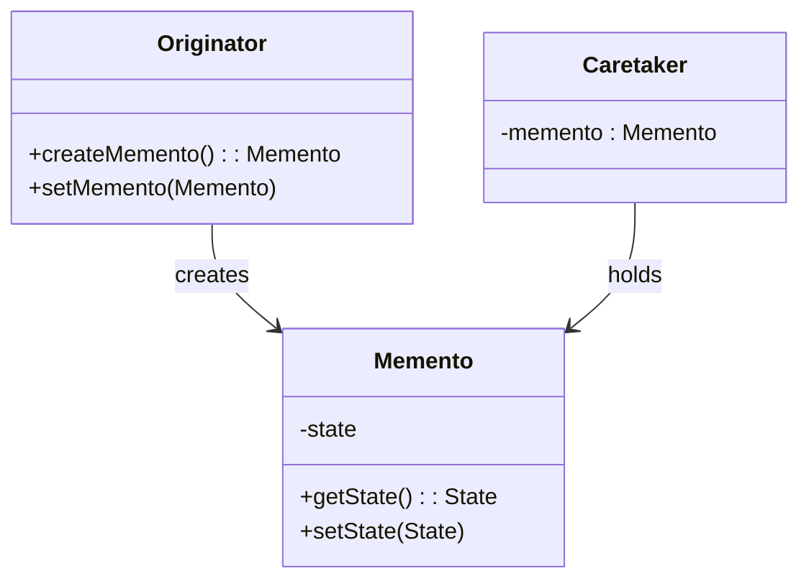

19. **Observer**

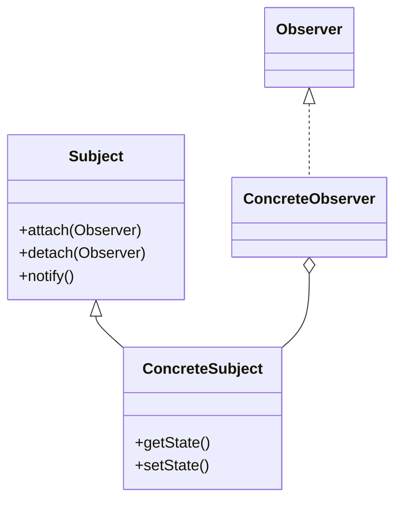

20. **State**

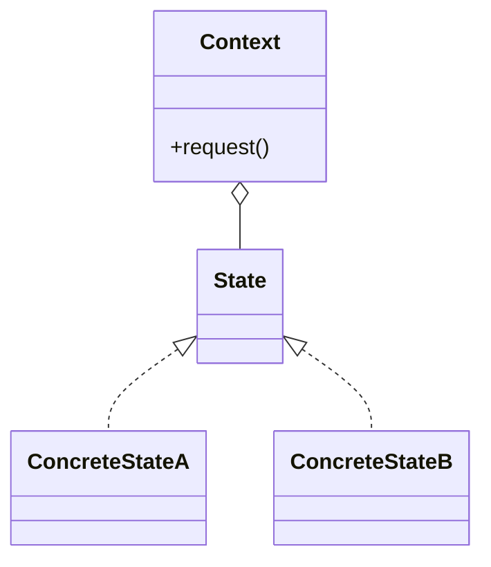

21. **Strategy**

```mermaid
classDiagram
    Context o-- Strategy : uses
    Strategy <|.. ConcreteStrategyA
    Strategy <|.. ConcreteStrategyB
```

22. **Template Method**

```mermaid
classDiagram
    class AbstractClass {
        +templateMethod()
        +primitiveOperation1()
        +primitiveOperation2()
    }

    class ConcreteClass {
        +primitiveOperation1()
        +primitiveOperation2()
    }

    AbstractClass <|-- ConcreteClass
```

23. **Visitor**

```mermaid
classDiagram
    Element <|-- ConcreteElementA
    Element <|-- ConcreteElementB
    Visitor <|.. ConcreteVisitor1
    Visitor <|.. ConcreteVisitor2
    Element : +accept(Visitor)
    ConcreteVisitor1 : +visitConcreteElementA(ConcreteElementA)
    ConcreteVisitor1 : +visitConcreteElementB(ConcreteElementB)
```

With these diagrams, you should have a clear visual representation of the relationships and roles in each pattern. Remember, these are general outlines; specifics might differ based on the particular use case and requirements.
