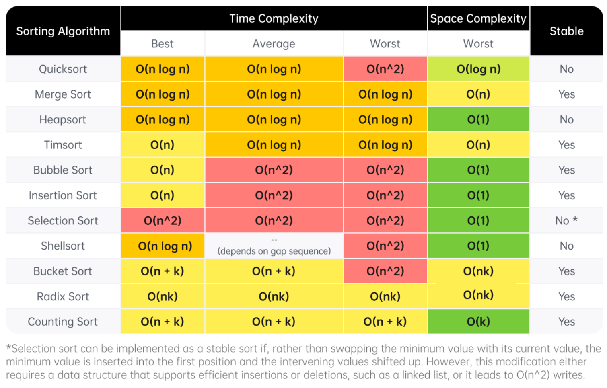

# Leetcode

Data Structure and Algorithm Practice for Leetcode

# Tutorial

[Data Structures and Algorithms in Python - Full Course for Beginners](https://www.youtube.com/watch?v=pkYVOmU3MgA&list=PLKnqXTZckz4m1-p_yyJ6p2IOvfft7FAmP&index=14&t=27081s&ab_channel=freeCodeCamp.org&descriptionFromFileType=Attached+File)

[Algorithms and Data Structures Tutorial](https://www.youtube.com/watch?v=8hly31xKli0&t=13876s&ab_channel=freeCodeCamp.org&descriptionFromFileType=Attached+File)

# Cheatsheets

This article will be a collection of cheat sheets that you can use as you solve problems and prepare for interviews. You will find:

Time complexity (Big O) cheat sheet
General DS/A flowchart (when to use each DS/A)
Stages of an interview cheat sheet

## Time complexity (Big O) cheat sheet

First, let's talk about the time complexity of common operations, split by data structure/algorithm. Then, we'll talk about reasonable complexities given input sizes.

**Arrays (dynamic array/list)**

Given n = arr.length

| Operation                                        | Time Complexity |
| ------------------------------------------------ | --------------- |
| Add or remove element at the end                 | O(1) amortized  |
| Add or remove element from arbitrary index       | O(n)            |
| Access or modify element at arbitrary index      | O(1)            |
| Check if element exists                          | O(n)            |
| Two pointers                                     | O(nk)           |
| Building a prefix sum                            | O(n)            |
| Finding the sum of a subarray given a prefix sum | O(1)            |

**Strings (immutable)**

Given n = s.length

| Operation                         | Time Complexity |
| --------------------------------- | --------------- |
| Add or remove character           | O(n)            |
| Access element at arbitrary index | O(1)            |
| Concatenation between two strings | O(n + m)        |
| Create substring                  | O(m)            |
| Two pointers                      | O(nk)           |
| Building a string from joining    | O(n)            |

**Linked Lists**

Given n as the number of nodes in the linked list

| Operation                               | Time Complexity |
| --------------------------------------- | --------------- |
| Add or remove element (given pointer)   | O(1)            |
| Add or remove element (without pointer) | O(n)            |
| Access element (without pointer)        | O(n)            |
| Check if element exists                 | O(n)            |
| Reverse between position i and j        | O(j - i)        |
| Detect a cycle                          | O(n)            |

**Hash Table/Dictionary**

Given n = dic.length

| Operation                                  | Time Complexity |
| ------------------------------------------ | --------------- |
| Add or remove key-value pair               | O(1)            |
| Check if key exists                        | O(1)            |
| Check if value exists                      | O(n)            |
| Access or modify value associated with key | O(1)            |
| Iterate over all keys, values, or both     | O(n)            |

**Set**

Given n = set.length

| Operation               | Time Complexity |
| ----------------------- | --------------- |
| Add or remove element   | O(1)            |
| Check if element exists | O(1)            |

**Stack**

Given n = stack.length

| Operation                          | Time Complexity |
| ---------------------------------- | --------------- |
| Push element                       | O(1)            |
| Pop element                        | O(1)            |
| Peek (see element at top of stack) | O(1)            |
| Check if element exists            | O(n)            |

**Queue**

Given n = queue.length

| Operation                            | Time Complexity |
| ------------------------------------ | --------------- |
| Enqueue element                      | O(1)            |
| Dequeue element                      | O(1)            |
| Peek (see element at front of queue) | O(1)            |
| Check if element exists              | O(n)            |

**Binary Tree (DFS/BFS)**

Given n as the number of nodes in the tree

| Operation       | Time Complexity |
| --------------- | --------------- |
| Most algorithms | O(nk)           |

**Binary Search Tree**

Given n as the number of nodes in the tree

| Operation               | Time Complexity                 |
| ----------------------- | ------------------------------- |
| Add or remove element   | O(n) (worst), O(logn) (average) |
| Check if element exists | O(n) (worst), O(logn) (average) |

**Heap/Priority Queue**

Given n = heap.length and talking about min heaps

| Operation                  | Time Complexity |
| -------------------------- | --------------- |
| Add an element             | O(logn)         |
| Delete the minimum element | O(logn)         |
| Find the minimum element   | O(1)            |
| Check if element exists    | O(n)            |

**Binary Search**

Given n is the size of your initial search space

| Operation     | Time Complexity |
| ------------- | --------------- |
| Binary search | O(logn)         |

Note: These time complexities represent the general case and may vary based on specific implementations or optimizations.

**Miscellaneous**

**Sorting**

n is the size of the data being sorted

| Operation | Time Complexity |
| --------- | --------------- |
| Sorting   | O(n log n)      |

**DFS and BFS on a Graph**

n is the number of nodes,
e is the number of edges

| Operation                | Time Complexity |
| ------------------------ | --------------- |
| DFS and BFS              | O(nk + e)       |
| Space Complexity (Graph) | O(n + e)        |

**Dynamic Programming**

n is the number of states and
k is the work done at each state

| Operation           | Time Complexity | Space Complexity |
| ------------------- | --------------- | ---------------- |
| Dynamic Programming | O(nk)           | O(n)             |

Note: These time and space complexities represent the general case and may vary based on specific implementations or optimizations.

## Sorting algorithms

## General DS/A flowchart

